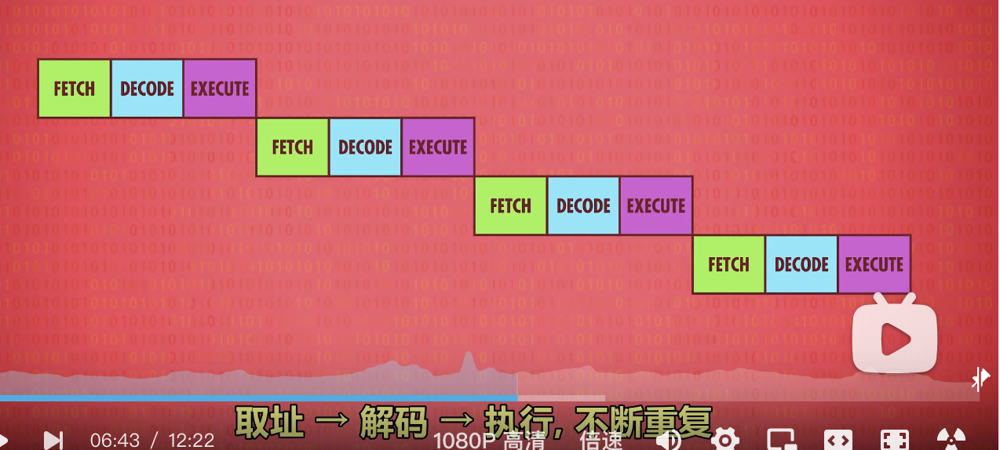
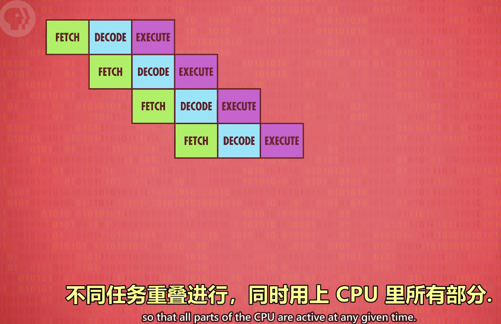

- 传统 CPU 和现代 CPU
	- 传统 CPU 的 ALU 不支持除法，比如 $16\%5$ 会用 $16-5-5-5-5$来计算，直到遇到了负数。
	- 现代计算机直接在 ALU里内置了除法。
	- 现代有一些特殊的 CPU，内置了专门电路处理图形操作、解码压缩视频、加密文件等。
	- → 所以，现在 CPU 的时钟开销更少。
- 现代 CPU遇到的问题
	- 为了兼容旧指令，指令集越来越多(现在有上千个)
	- ==超高速的时钟，导致数据读取、传输速度跟不上== → RAM 成为瓶颈
		- 在 CPU内部增加 Cache(一个小的 RAM)
		- 每次去 RAM读数据，不是读一 Byte，而是读一批存到Cache
			- CPU到 Cache 取数据，只要一个时钟
			- CPU 去 RAM 取数据，需要多个时钟
			- 如果 Cahce 中某个 Byte 的数据和 RAM 不一致，就会有一个标记位(dirty bit）。当要清空cahce时，会先检查dirty bit，如果 true 就要先写回 RAM。
		- CPU 从顺序改为并行执行
			- CPU 执行一个指令的 3 个步骤FETCH - DECODE - EXECUTE
			- 
			- 
		- CPU  预测接下来要执行的一批指令(预测准确率 90%)→提前 fetch
		- 多 CPU 多核