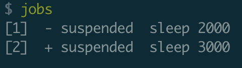

- > 目标: 学习如何同时执行多个不同的进程并追踪它们的状态、如何停止或暂停某个进程以及如何使进程在后台运行。
- {{renderer :toc_vpciacvr}}
	- ## 1 Job Control ⭐️
		- ### 1.1 killing a process
			- 1.1.1 `ctrl+c` → when typing `ctrl+c` the shell to deliver a `SIGINT` signal to process, and to quit process.
			- 1.1.2 shell use [[#green]]==signal== to ctrl process. You can type `man signal` to view different signal.
			- 1.1.3 `kill -TERM <PID>` will send `SIGTERM` to end process.
		- ### 1.2 Pausing and backgrounding processes
			- 1.2.1 `ctrl+z` will send `SIGSTP` to pause process
			  
			- 1.2.2 `jobs` to view all not-finish cmd
			  
			- 1.2.3 add `&` after cmd, it will let job work in background, but it will still in stadout.
			  
			- 1.2.3 `bg` and `fg` cmd restart jobs which were paused.
			  
			- 1.2.4 or use kill to kill paused `kill %number`
			  
			- 1.2.5 when you close your terminal, it will send a `SIGHUP` to stop jobs which running on this terminal. You can use cmd `nohup` to ignore `SIGHUP`, eg `nohup sleep 2000 &`
	- ## 2 Terminal Multiplexers ⭐️
		- use iTerm2 in mac
	- ## 3 Aliases
	- ## 4 Dotfiles ⭐️
		- ### 4.1 Introduce
			- most program use dotfile as config file
			- some important dotfiles
				- `bash` - `~/.bashrc`, `~/.bash_profile`
				- `git` - `~/.gitconfig`
				- `vim` - `~/.vimrc` and the `~/.vim` folder
				- `ssh` - `~/.ssh/config`
				- `tmux` - `~/.tmux.conf`
			- suggestions
				- use git to ctrl it
				- put it in it's own folder
				- symlinked into place useing a script
		- ### 4.2 Portability
			- It aims to work in diff env
			- How to do
				- use if to judge
				- use include
				- set them in a repo
				- 
			- Mac、项目 dotfile 管理最佳实践
			  id:: 62a85dc0-2cf8-4fbe-8123-e44e03aafa61
				- dotfiles丢在git仓库中，删除本地对应的文件，用symbolic link取代
				- [Mac 软链接技术](https://juejin.cn/post/7006550403252764680)
				- 另一个方案(针对小项目)
					- 项目建 `example.go`，跟随仓库同步
					- 项目本地的配置目录 config，被 `.gitignore`。在config下建立 local.go, dev.go, production.go作为切换。
					- 增加管理脚本，可以在 `Makefile`里增加一些 action, 比如`cp example.go config/loca.go`
	- ## 5 Remote Machines ⭐️
	  id:: 62aef439-e509-4628-84c8-ac0644b4c2f8
		- ### 5.1 Executing commands
			- ssh = security shell
			- `ssh user_name@remove_machine_ip_or_domain`
		- ### 5.2 SSH Keys
			- use ssh key, put your pri_key in local, and pub_key in remove machine
		- ### 5.3 Copy data to remove
			- `ssh+tee`: `cat localfile | ssh remove_server tee serverfile`
			- `scp`: `scp local_path_file remove_host:remote_path_file`
		- ### 5.4 SSH Config Real Case
			- 1、本地生成 primary+public key. `ssh-keygen -o -a 100 -t ed25519 -f ~/.ssh/id_ed25519`
			- 2、将public key的内容复制到remote machine 上，通常位置为：`~/.ssh/authorized_keys`
			- 3、登录验证 `ssh -i primary_key_path root@124.223.161.92`
			- 4、配置到 `~/.ssh/config` 中
			  ```shell
			  Host cvm
			    User root
			    HostName 124.223.161.92
			    IdentityFile ~/Code/alucard-ltd/xlog/Shell/quick-setup-my-computer/alias/cvm/id_ed25519
			  ```
			- 5、再次验证 `ssh cvm`
	- ## 6 Shells & Frameworks
		- use zsh
	- ## 7 Terminal Emulators
		- use iTerm2
	- ## 8 Exercises