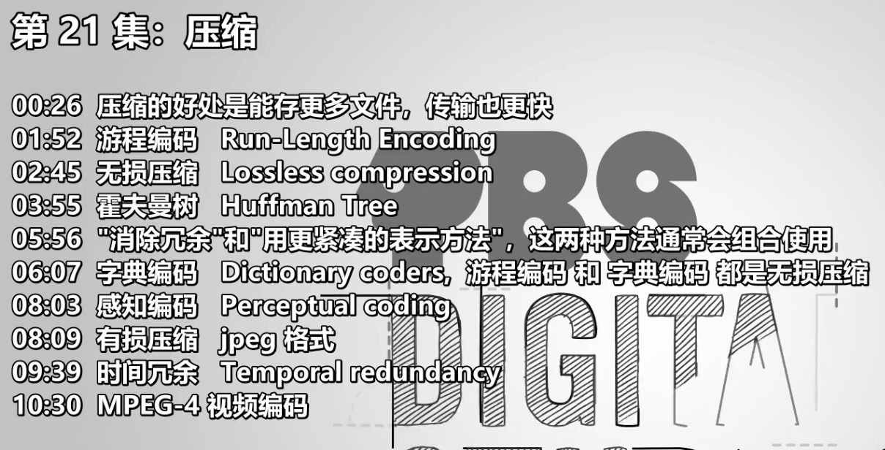
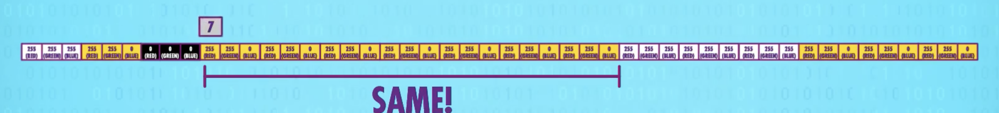

- 
- 压缩的好处是能存更多文件，传输也更快
- 字典编码 Dictionary coders, 游程编码 和 字典编码 都是==无损压缩==
	- 游程编码 Run-Length Encoding
	  collapsed:: true
		- 是一种无损压缩，能完整恢复到之前的样子
		- before
		  
		- after compress
		  
	- 霍夫曼树 Huffman Tree
	- "消除冗余"和"用更紧凑的表示方法"，这两种方法通常会组合使用
- 有损压缩
	- 感知编码 Perceptual coding
	- 有损压缩 jpeg 格式
	- 时间冗余 Temporal redundancy
	- MPEG-4 视频编码