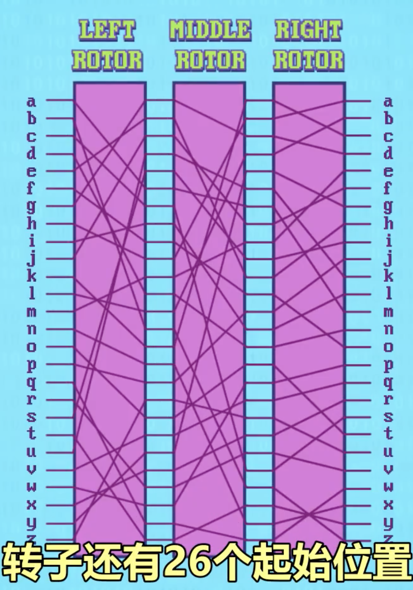

- 多层防御 Defence in depth
- 加密 - Encryption，解密 - Decryption
- 对称加密
	- 凯撒加密 Caesar cipher
		- 字母向前或后挪动 N 位
	- 替换加密 Substitution cipher
		- 用一个英文字母映射另一个英文字母
		- 
	- 移位加密 Permutation cipher
	- 列移位加密 Columnar transposition cipher
	- 加密机器和标准
		- 德国 Enigma 加密机
		- 1977 年"数据加密标准" - Data Encryption Standard (DES)
		- 2001 年"高级加密标准" - Advanced Encryption Standard (AES)
	- 密钥交换 - Key exchange
		- 通过一个双方都知道的秘钥进行加密
	- 用颜色来举例"单向函数"和"密钥加密"的原理
	- 迪菲-赫尔曼密钥交换 - Diffie-Hellman Key Exchange
- 非对称加密 - Asymmetric encryption
	- 非对称加密算法 RSA