title:: DB: 数据对象关联关系+UML 类图

- ## UML 类图
  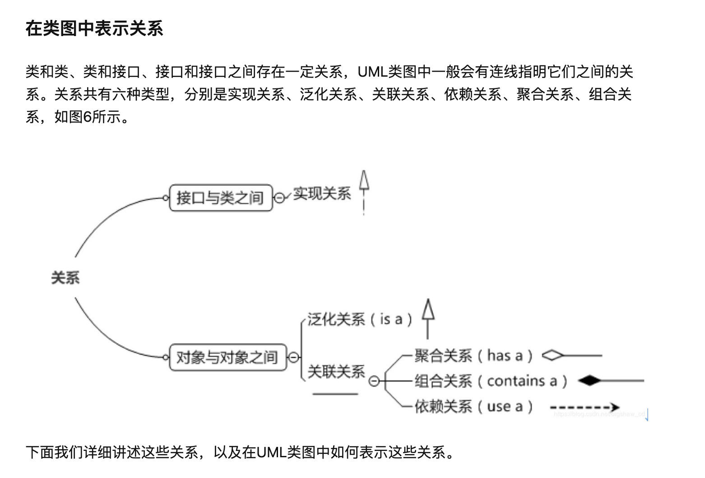
- ## 数据对象关联关系
  
  _在 Java 或其它面向对象设计模式中，类与类之间主要有 6 种关系，他们分别为：依赖，关联，聚合，组合，继承，实现。他们的耦合度依次增强。_
	- #### 1. 依赖
	  A 用了一下 b，a 依赖 b。
	  对象本身之间是独立的。
	  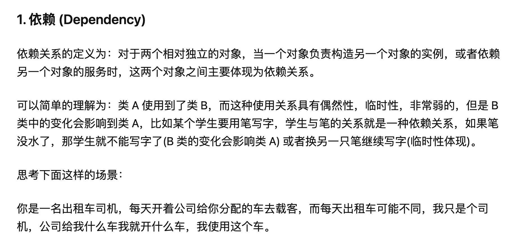
	  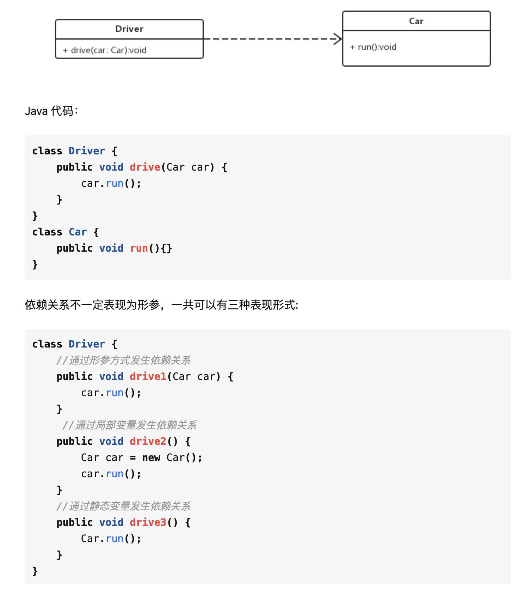
	  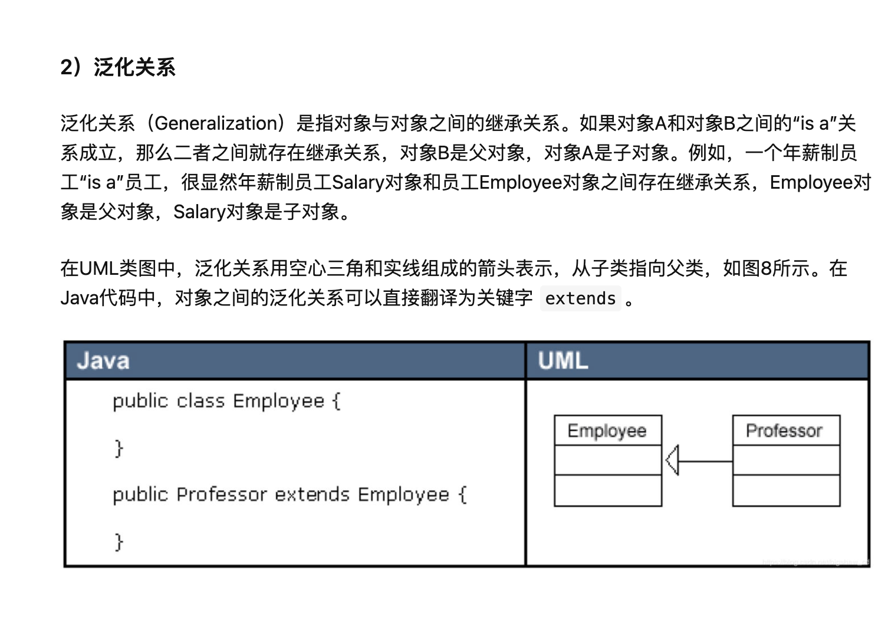
	- #### 2. 关联
	  a 和 b 的关系很明显，一个是另一个的成员变量。
	  分为`单向依赖`和`双向依赖`。
	  对象本身之间是独立的。
	  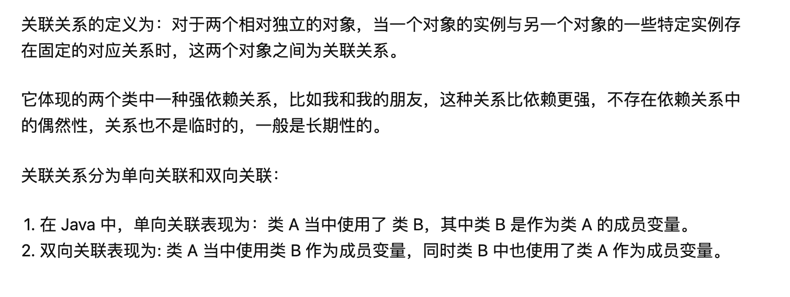
	  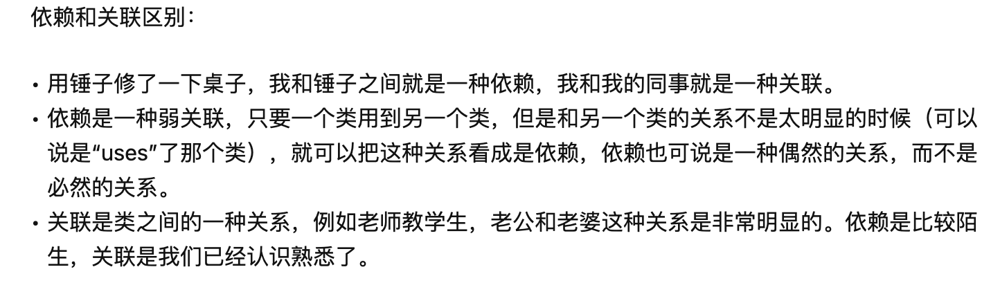
	- #### 3. 聚合
	  一个作为另一个的成员变量，使用 set 方法赋值。
	  对象是“整体-个体”的关系。
	  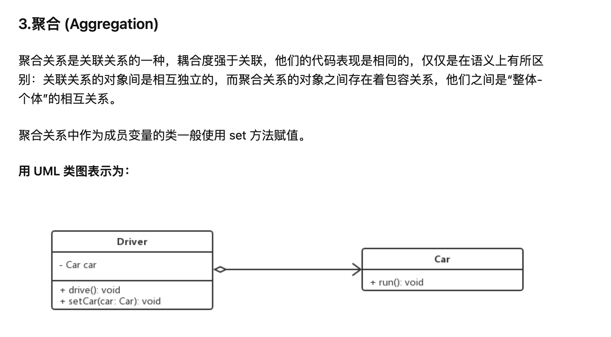
	- #### 4. 组合
	  对象是 `整体 - 部分` 之间的关系。
	  整体负责部分的生命周期。
	  整体没有了，部分也就没有意义了。
	  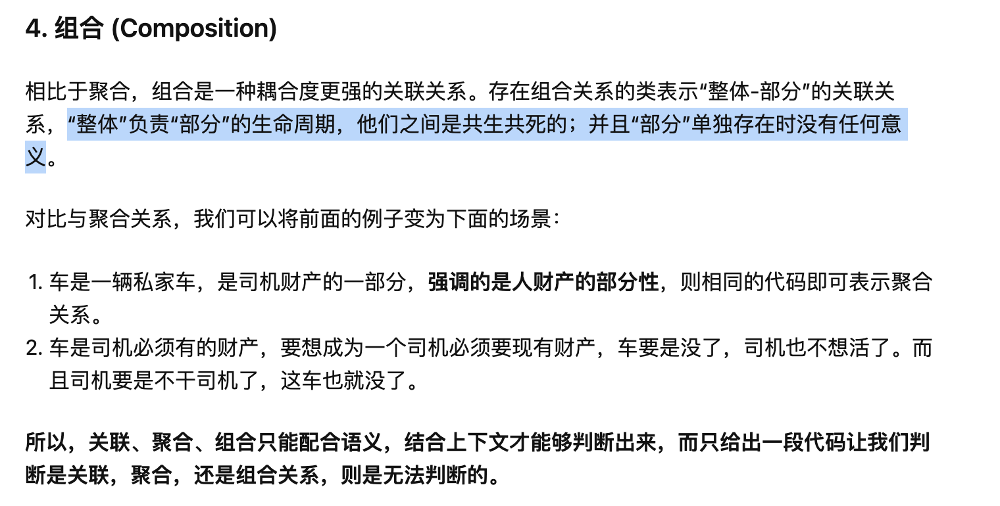
	- #### 5. 继承
	  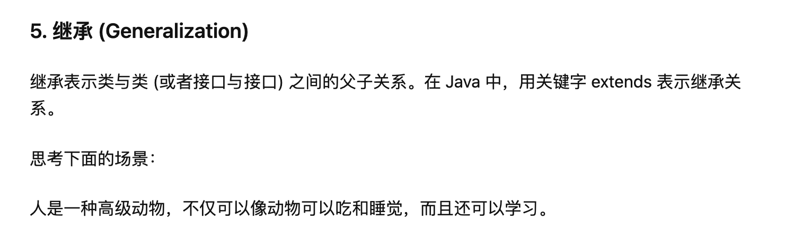
	- #### 6. 实现
	  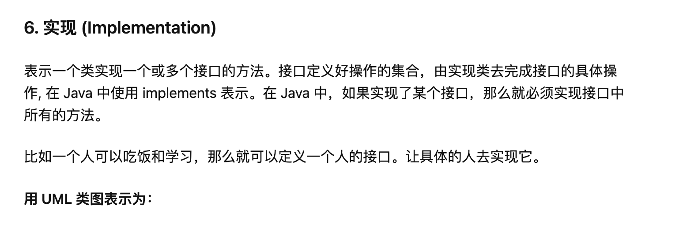
	- #### commets
	  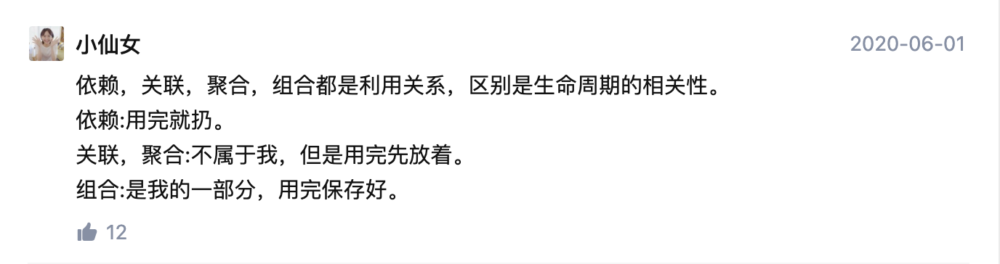
- 参考文献
  [30 分钟学会 UML 类图 - 知乎](https://zhuanlan.zhihu.com/p/109655171)
  [设计模式之 UML 类图 - 知乎](https://zhuanlan.zhihu.com/p/24576502)