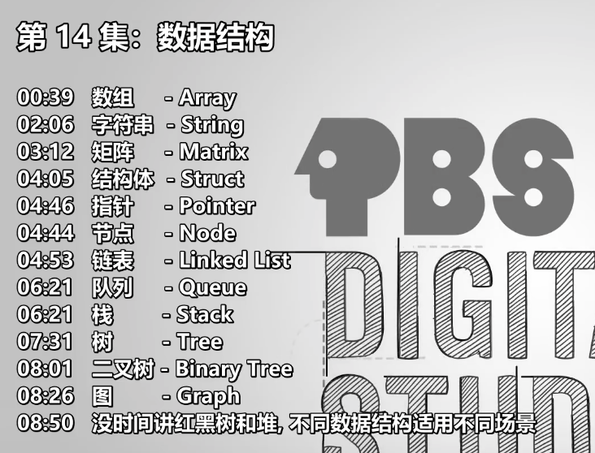
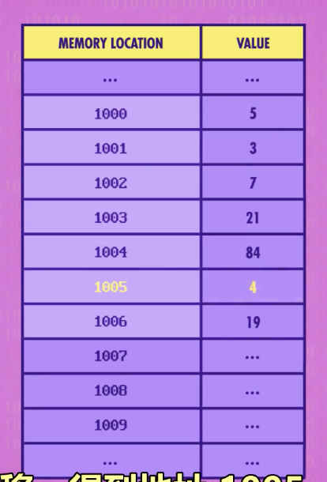
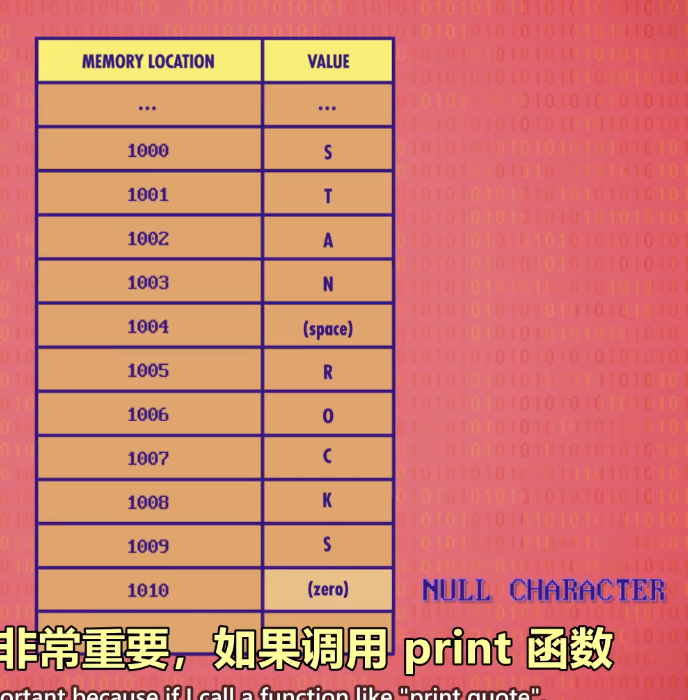
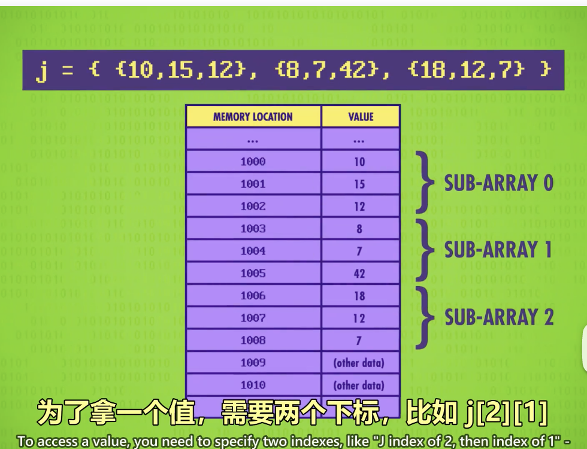
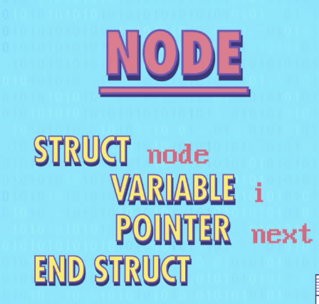
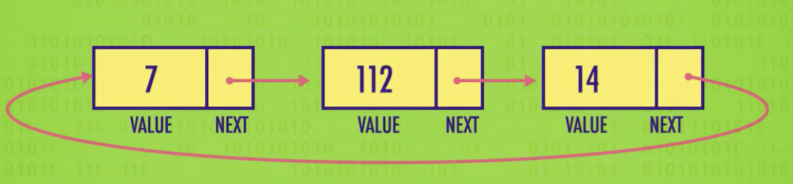
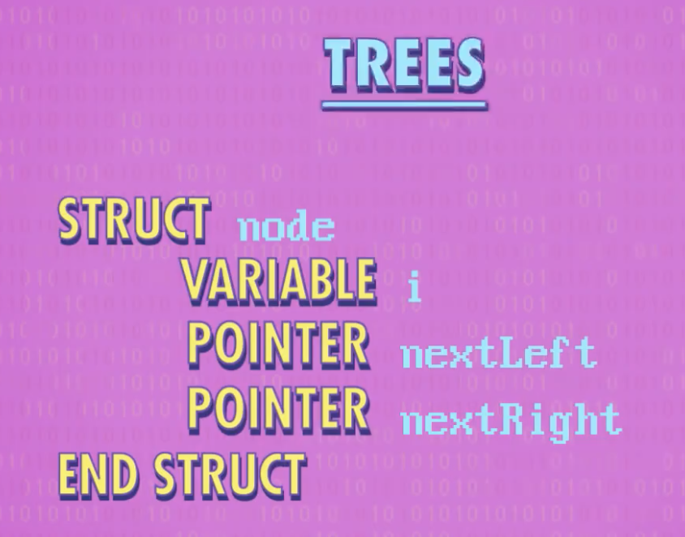
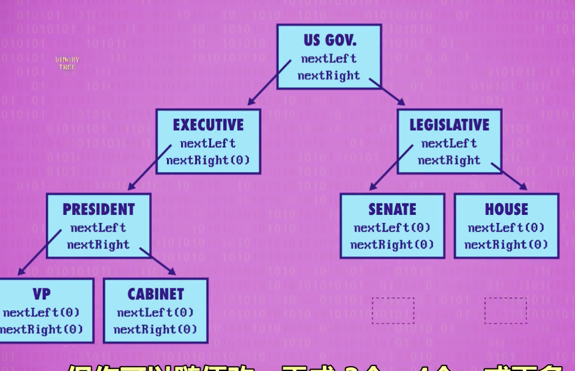
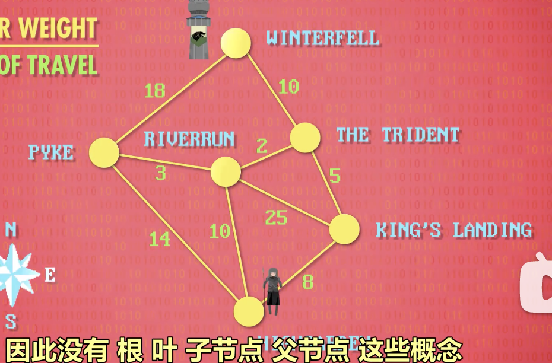

- 
- 数组 - Array
	- `Arrays`, also called `lists` or `Vectors` in some languages
	- 在 Memory 中一段连续Addr 的存储
	  
- 字符串 - String
	- 本质是一个存储字符的Array
	- 在 C 里，结尾以二进制的 0 表示，也就是null。
	  
- 矩阵 - Matrix
	- You can think of a `Matrix` as an `array of arrays`
	- 定长
	  
- 结构体 - Struct
	- 
	- 节点 - Node
	- 指针 - Pointer
- 链表 - Linked List
	- 
	- 队列 - Queue
		- FIFO
	- 栈 - Stack
		- LIFO
		- 
- 树 - Tree
	- 
	- 二叉树 - Binary Tree
		- 
	- 图 - Graph
		- 