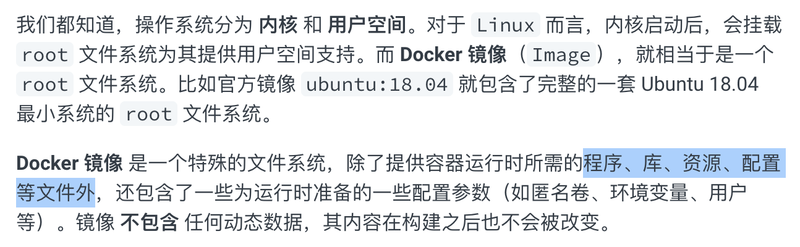
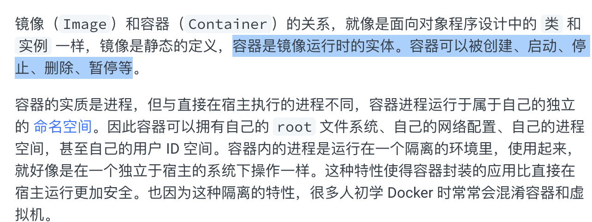
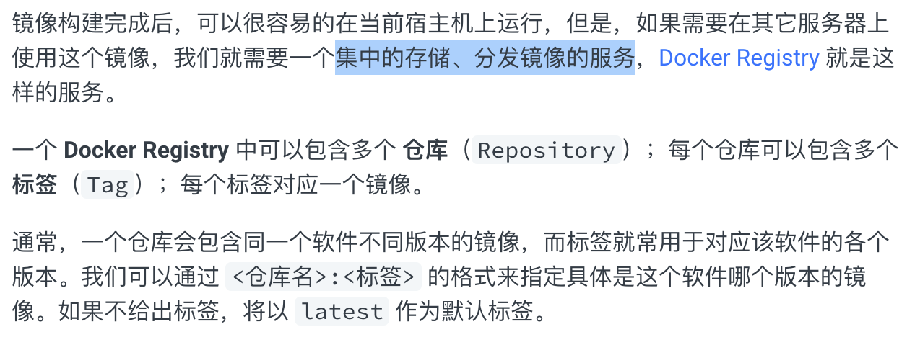
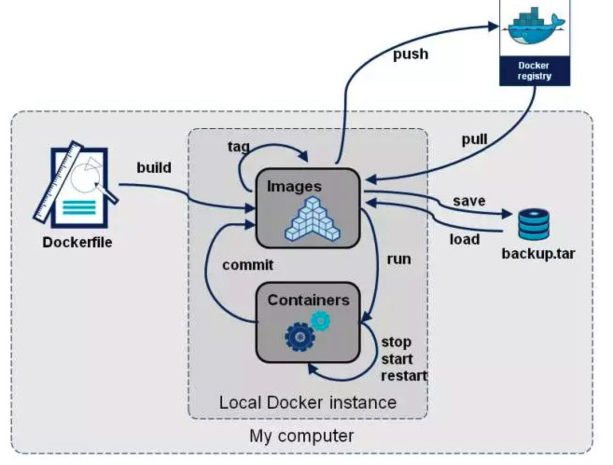

- 概念
	- 1、要知道当前学习的这门技术是一个`什么`东西？
		- 轻量的虚拟机。
	- 2、学习一种语言，或者技术框架、系统 等等..要知道它`为什么`存在,以及它的作用和应用场景？
		- 场景：服务部署。
		- 解决了什么问题：环境隔离，一键化部署、迁移。
	- 3、最后才是想办法如何去掌握其中重要的技术以及知识点？
		- 1、本地服务容器化部署；
		- 2、容器运维；
- 底层数据模型和设计理念
	- Data Model
		- 镜像 Image
			- 
		- 容器 Container
			- 
		- 仓库 Repository
			- 
	- 理念
		-
- 笔记
	- CMD
		- 
	- Docker 运维
		-
- 参考
	- [3分钟带你吃透Docker工作原理与核心概念](https://blog.nowcoder.net/n/01723f0316af428d96e5e0e5f2658b56?from=nowcoder_improve)