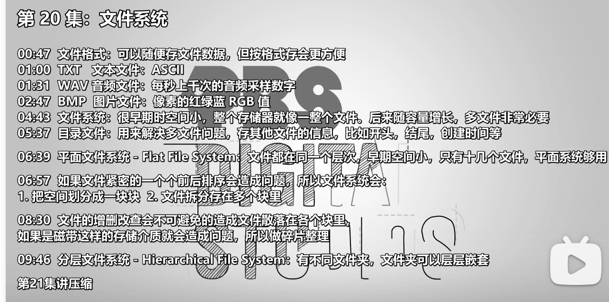
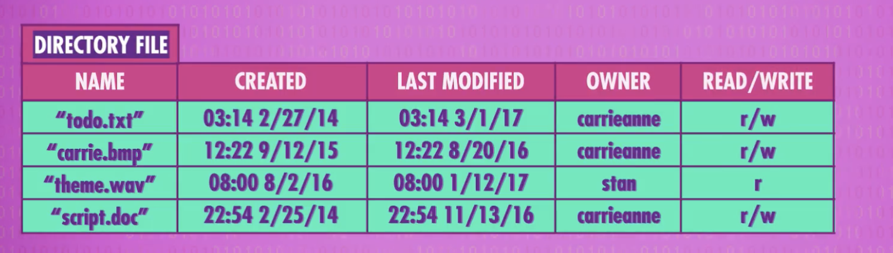
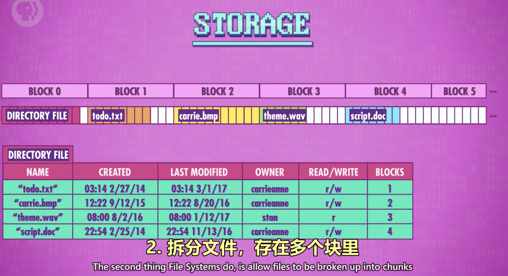
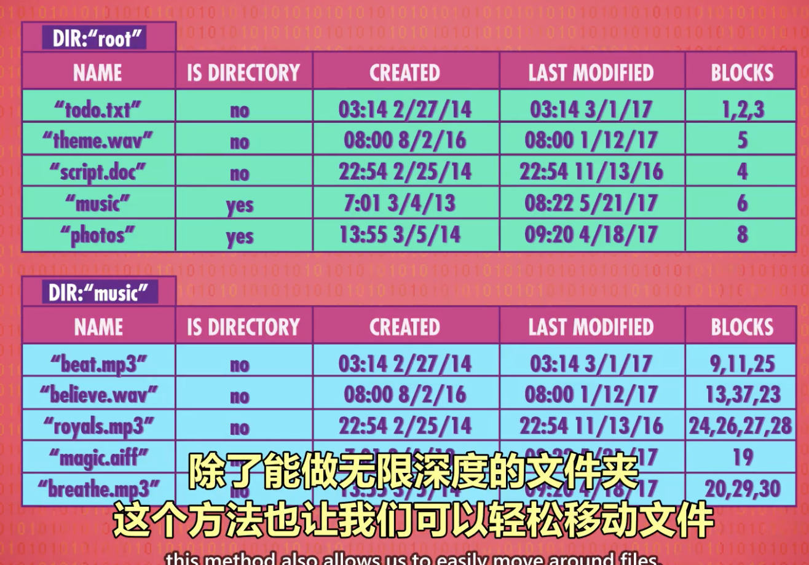

- 
- 文件格式：可以随便存文件数据，但按格式存会更方便
- TXT 文本文件：ASCII
- WAV 音频文件：每秒上千次的音频采样数字
- BMP 图片文件：像素的红绿蓝 RGB 值
- 文件系统：很早期时空间小，整个存储器就像一整个文件。后来随容量增长，多文件非常必要
- 目录文件：用来解决多文件问题，存其他文件的信息，比如开头，结尾，创建时间等
	- 
- 平面文件系统 - Flat File System：文件都在同一个层次，早期空间小，只有十几个文件，平面系统够用
- 如果文件紧密的一个个前后排序会造成问题，所以文件系统会： 1. 把空间划分成一块块 2. 文件拆分存在多个块里
	- 
- 文件的增删改查会不可避免的造成文件散落在各个块里，如果是磁带这样的存储介质就会造成问题，所以做碎片整理
	- 计算机会把分散在各处的碎片整理，挪到一处
- 分层文件系统 - Hierarchical File System：有不同文件夹，文件夹可以层层嵌套
	- 一种实现方法
	  