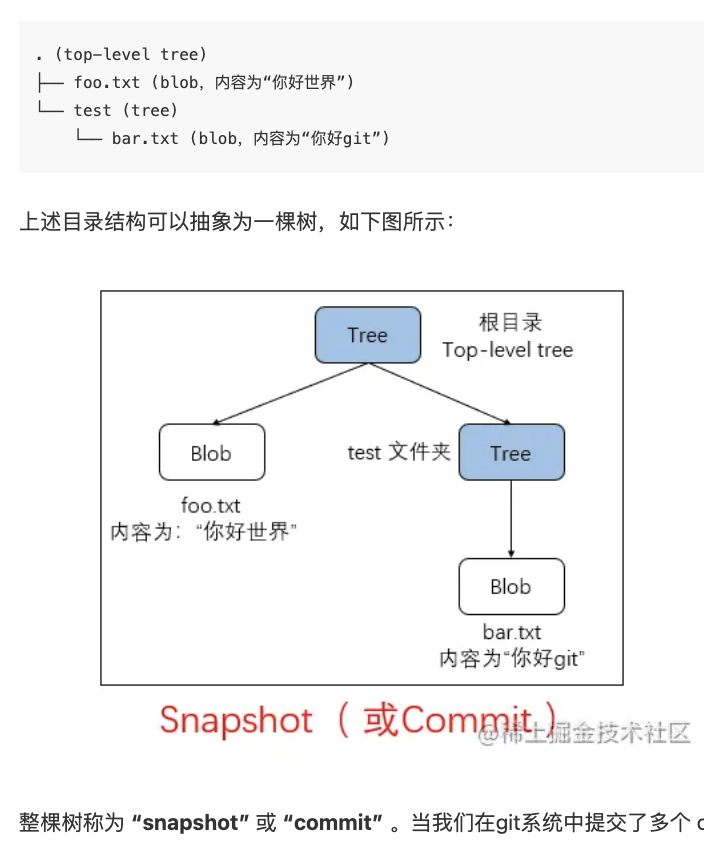

- {{renderer :toc_hxccspt}}
	- # 1 Git’s data model
		- ## Snapshots
			- 
		- ## Modeling history: relating snapshots
			- 每个snapshot 或 commit 组成的 DAG，就叫做 history
		- ## Data model, as pseudocode
			- ```
			  // 文件就是一组数据
			  type blob = array<byte>
			  
			  // 一个包含文件和目录的目录
			  type tree = map<string, tree | blob>
			  
			  // 每个提交都包含一个父辈，元数据和顶层树
			  type commit = struct {
			      parent: array<commit>
			      author: string
			      message: string
			      snapshot: tree
			  }
			  ```
		- ## Objects and content-addressing
		- ## References
			- 即分支，本质是一个指向commit(snapshot)的指针。
		- ## Repositories
			- ```shell
			  $ tree .git
			  .git
			  ├── HEAD				// 指向当前所在分支
			  ├── config				 //  一些配置，比如大小写等
			  ├── description
			  ├── hooks				// 一些钩子
			  │   ├── applypatch-msg.sample
			  │   ├── commit-msg.sample
			  │   ├── fsmonitor-watchman.sample
			  │   ├── post-update.sample
			  │   ├── pre-applypatch.sample
			  │   ├── pre-commit.sample
			  │   ├── pre-merge-commit.sample
			  │   ├── pre-push.sample
			  │   ├── pre-rebase.sample
			  │   ├── pre-receive.sample
			  │   ├── prepare-commit-msg.sample
			  │   ├── push-to-checkout.sample
			  │   └── update.sample
			  ├── info			// include .gitignore info
			  │   └── exclude
			  ├── objects		// 存放 Object 的数据库，存放整个项目的数据
			  │   ├── info
			  │   └── pack
			  └── refs			// 存放指向 Object 的指针
			      ├── heads
			      └── tags
			  ```
	- # 2 Staging area
	- # 3 Git command-line interface
		- ## Basics
		- ## Branching and merging
		- ## Remotes
		- ## Undo
	- # 4 Advanced Git
	- # 5 Miscellaneous
	- # 6 Resources
	- # 7 Exercises