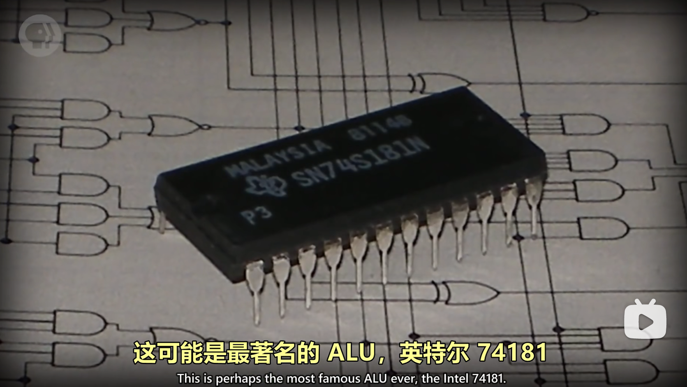
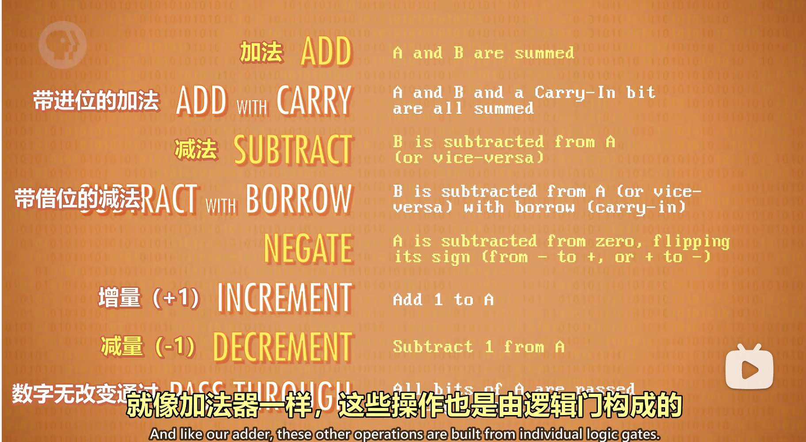
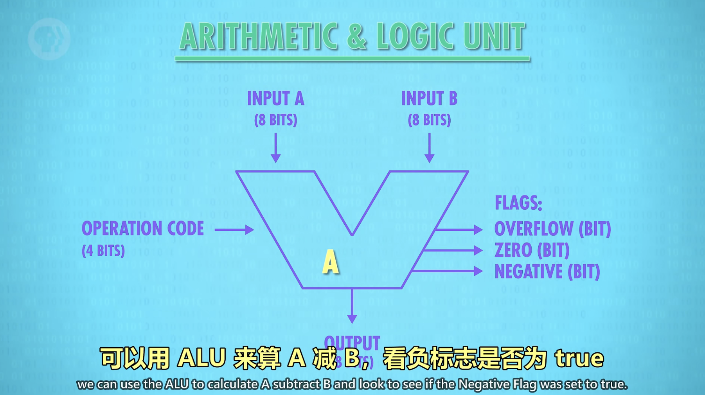

- ALU: Arithmetic And Logic Unit
- 
- ALU has two unit = 1 Arithmetic Unit + 1 Logic Unit
	- Arithmetic Unit
	- Logic Unit
- ALU support
	- 
- ALU level abstract
	- input: a and b and operation code
	- output: flags and output value
	- 
- ^^many ALU can compose CPU^^