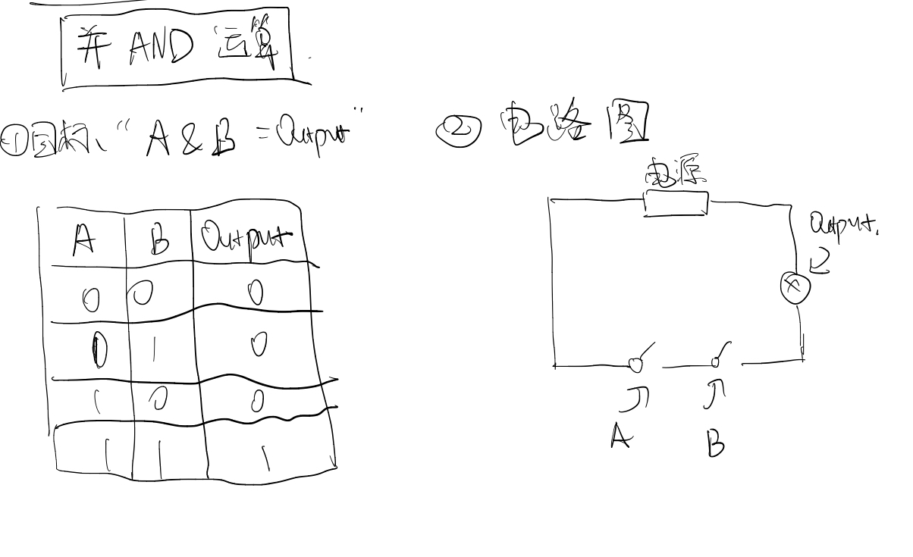
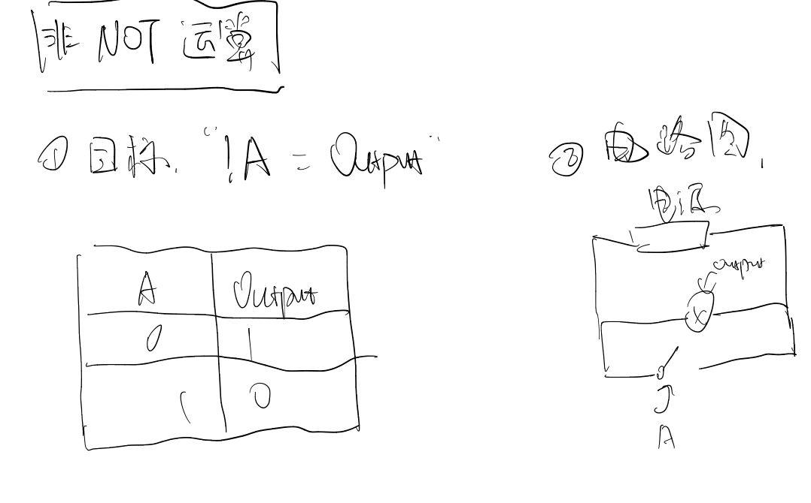
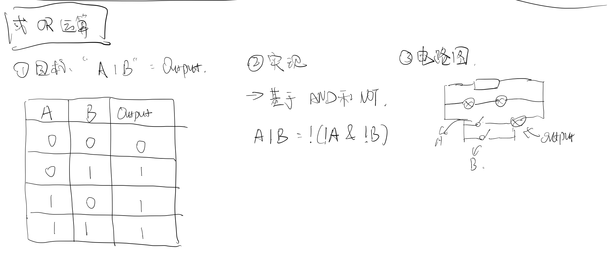
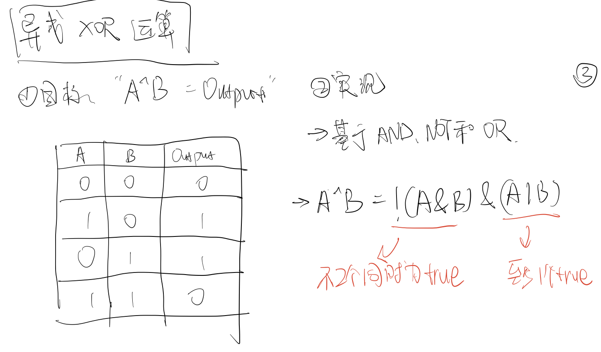
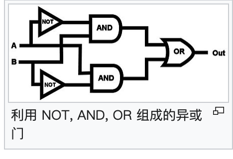
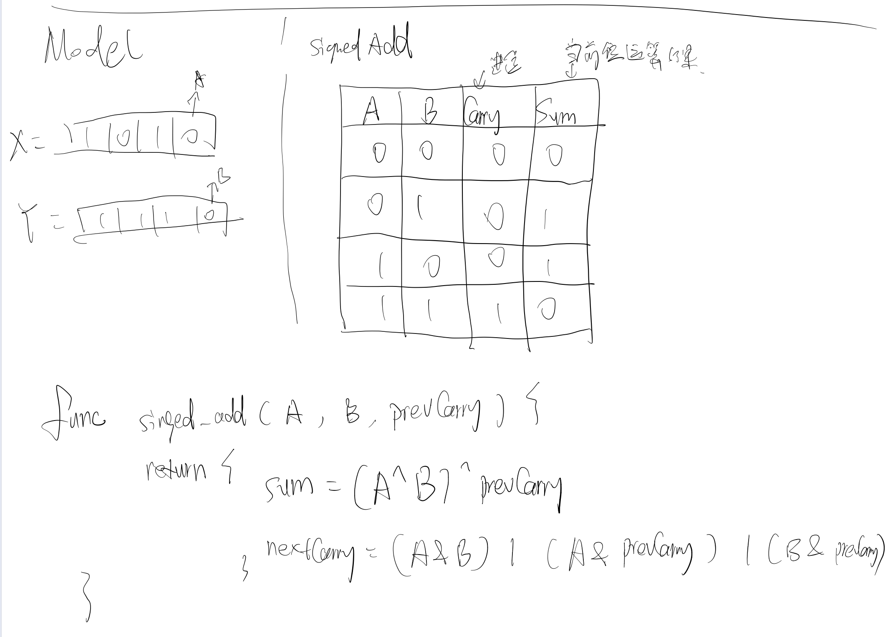
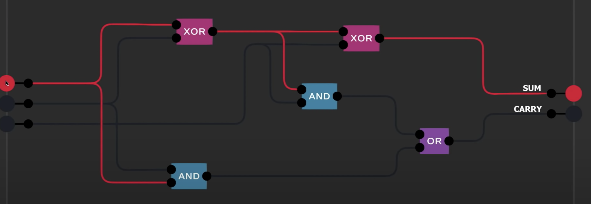
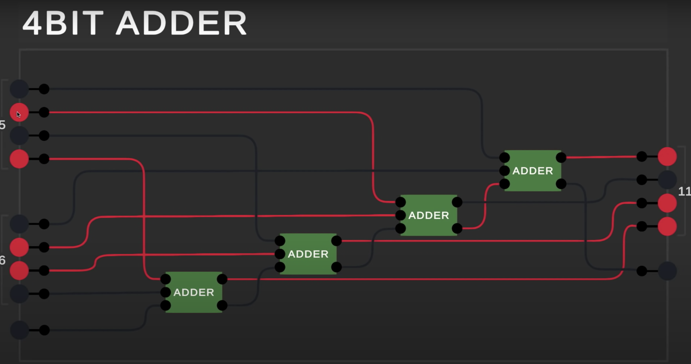
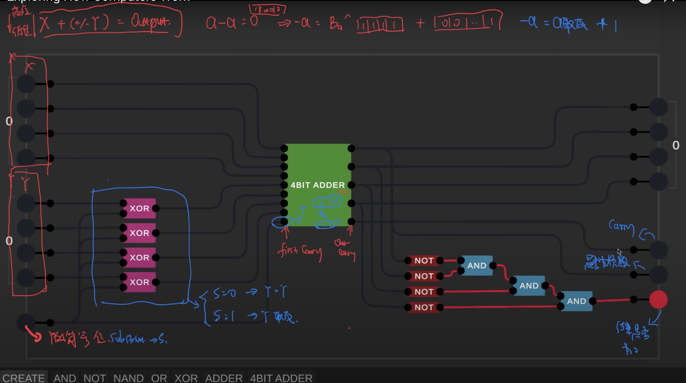

- {{renderer :toc_qpfpwqj}}
	- ## 1 基础逻辑运算符的实现
		- #### 1.1 逻辑并 AND
			- 
		- #### 1.2 逻辑非 NOT
			- 
		- #### 1.3 逻辑或 OR
			- 
		- #### 1.4 逻辑异或 XOR
			- 
			- 
	- ## 2 加减法法的实现
		- #### 2.1 加法
			- 一个位加的实现
				- 
				- 
				- 3个输入(A, B, PrevCarry)， 2 个输出(SUM, NextCarry), 标记为单元 `Adder`
			- 4-bits add
				- 
		- #### 2.2 减法
			- 
	- ## 3 逻辑门的符号表示
		- 作用：将逻辑门简化，将逻辑门用于构建更大的组件，而不至于太复杂。
		- 图例
			- 非门：用三角形+圆圈表示
			- 与门：用D型图案表示
			- 或门：用类似D向右弯曲的图案表示
			- 异或门：用或门+一个圆弧表示
			- 
	- ## Reference
		- [Exploring How Computers Work](youtube.com/watch?v=QZwneRb-zqA)
-