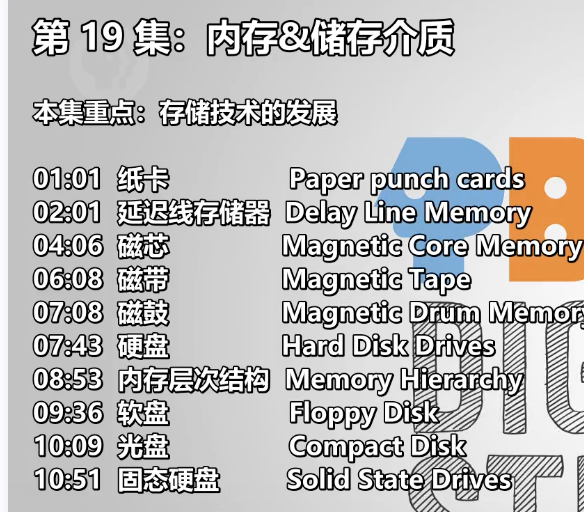
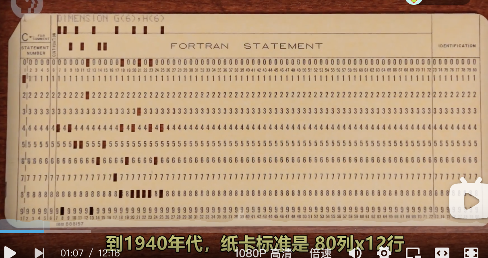
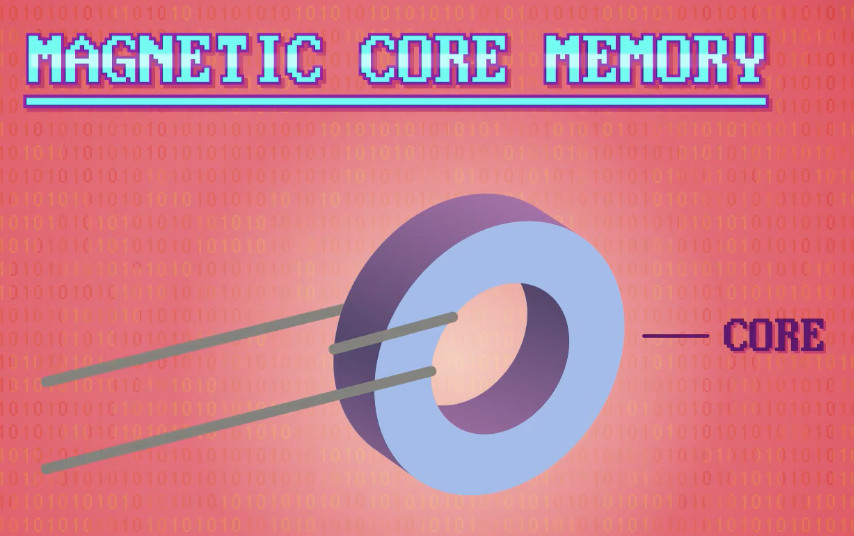
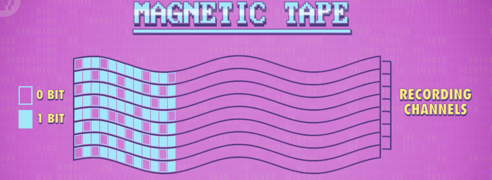
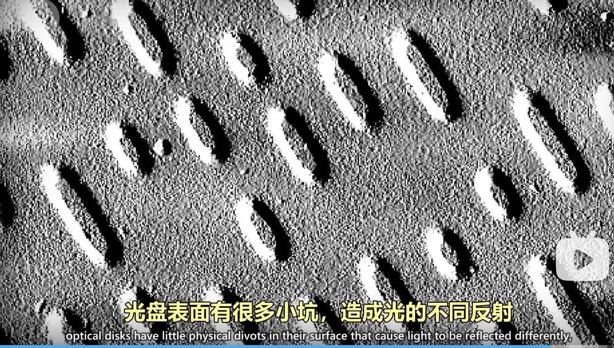

- 
- 纸卡 Paper punch cards
	- 
- 延迟线存储器 Delay Line Memory
- 磁芯 Magnetic Core Memory
	- 
- 磁带 Magnetic Tape
	- 
- 磁鼓 Magnetic Drum Memory
- 硬盘 Hard Disk Drives
- 内存层次结构 Memory Hierarchy
- 软盘 Floppy Disk
- 光盘 Compact Disk
	- {:height 288, :width 493}
	- 光学传感器会捕捉到，并解码为 1 和 0
- 固态硬盘 Solid State Drives