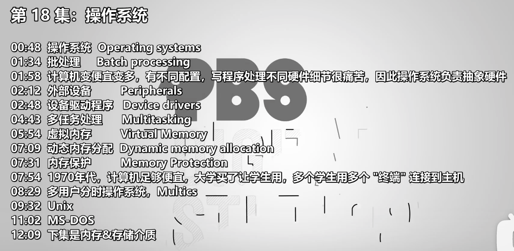
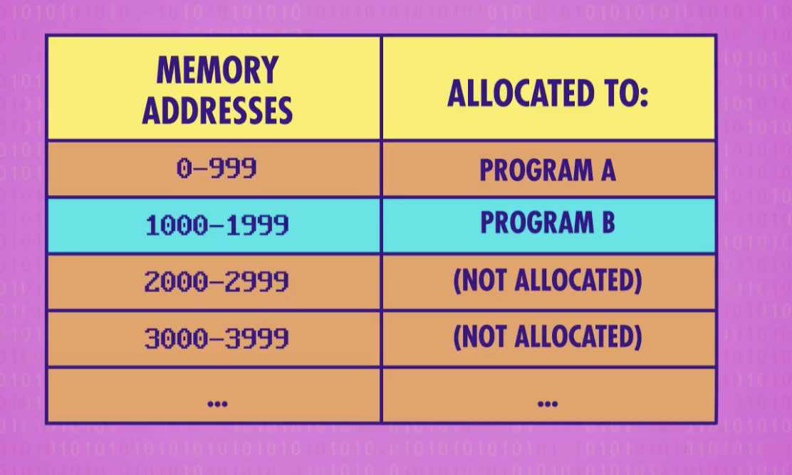
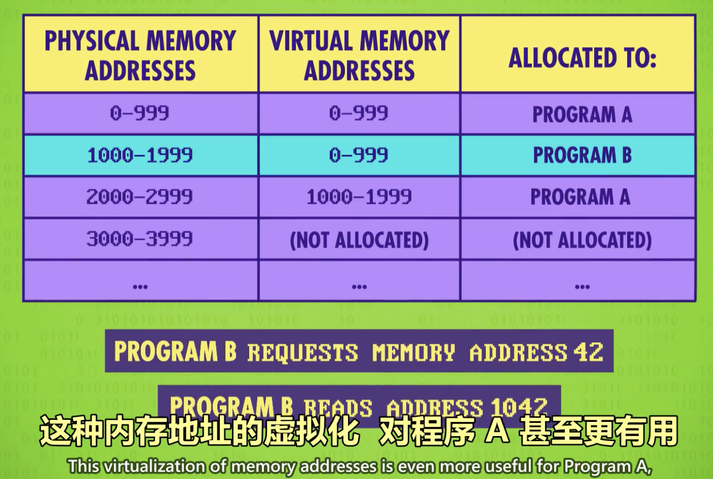

- 
- 操作系统 Operating systems
	- 产生动机
		- 早起打卡片机时代，只能一个程序一个程序执行，一个执行完后，人工操作放入下一个卡片
		- 后来计算机运行越快，放的时间比机器执行的时间更长了
	- 操作系统
		- 
		- 提供软件运行管理，提高效率等
	- 概念
		- 是一个特殊的软件，有操作硬件的权限
		- 常驻一块存储，以及开机启动
- 批处理 Batch processing
	- 为了解决效率问题，可以一次放一批软件，依次执行
- 计算机变便宜变多，有不同配置，写程序处理不同硬件细节很痛苦，因此操作系统负责抽象硬件
	- 计算机普及了，大家开始分享自己写的程序。但是底层计算机硬件不同，导致程序员还要关心硬件的适配
- 外部设备 Peripherals
- 设备驱动程序 Device drivers
- 多任务处理 Multitasking
	- 多任务执行，避免内存数据混淆，需要给每个任务程序分配独有的内存。但是会带来问题，==一个程序分配的内存地址不连续==。
	- {:height 274, :width 441}
- 虚拟内存 Virtual Memory
	- 针对内存分配地址不连续的问题
	- 
	- 
- 动态内存分配 Dynamic memory allocation
- 内存保护 Memory Protection
- 1970年代，计算机足够便宜，大学买了让学生用，多个学生用多个 "终端" 连接到主机
- 多用户分时操作系统，Multics
- Unix
	- 操作系统分成两个部分
		- 内核：如内存管理、多任务和输入、输出处理
		- 一堆有用的工具
- MS-DOS