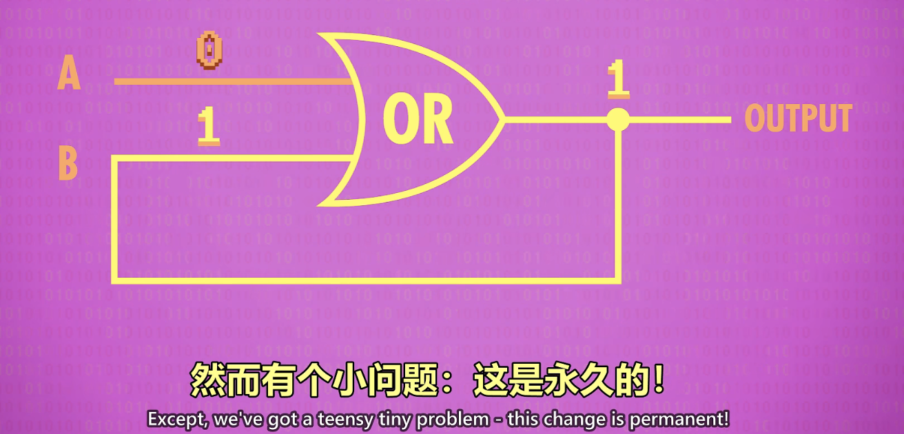
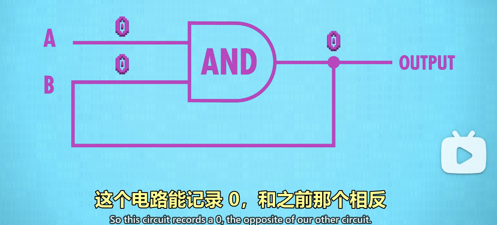
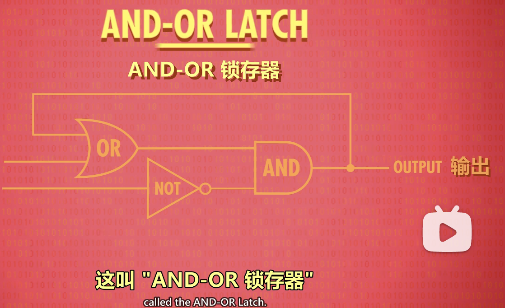
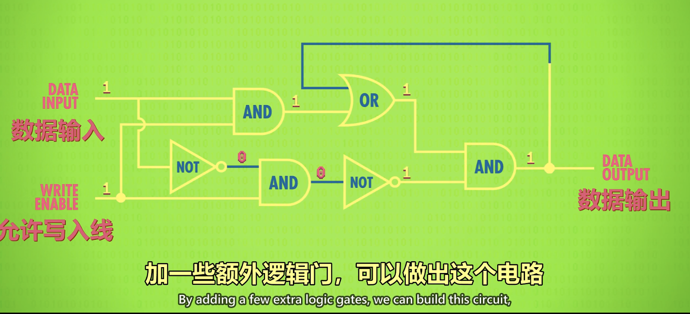
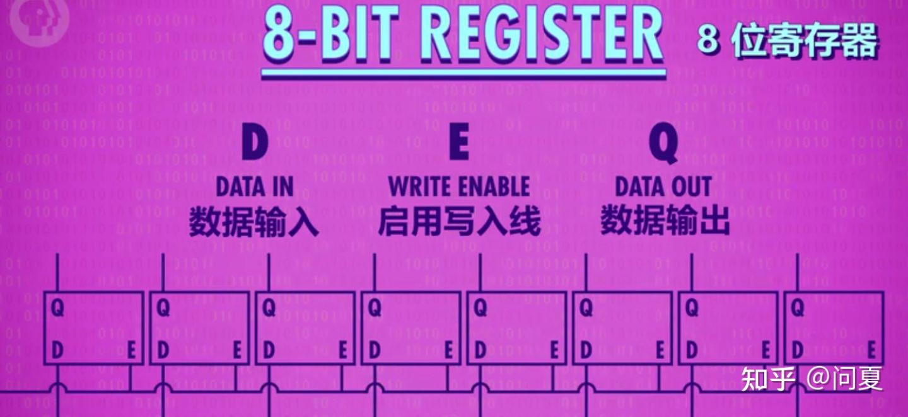
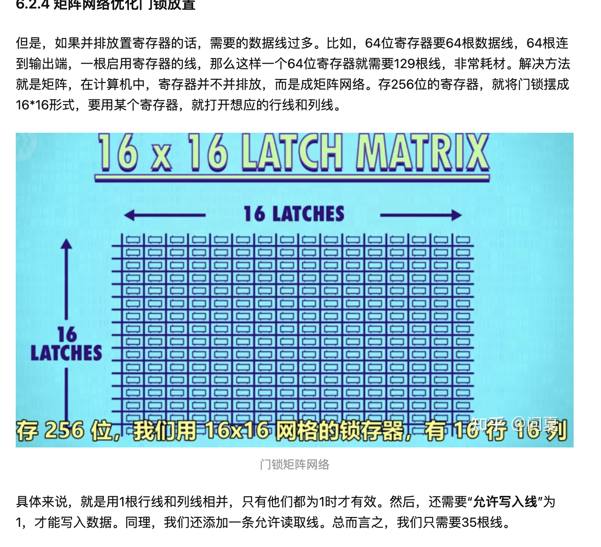
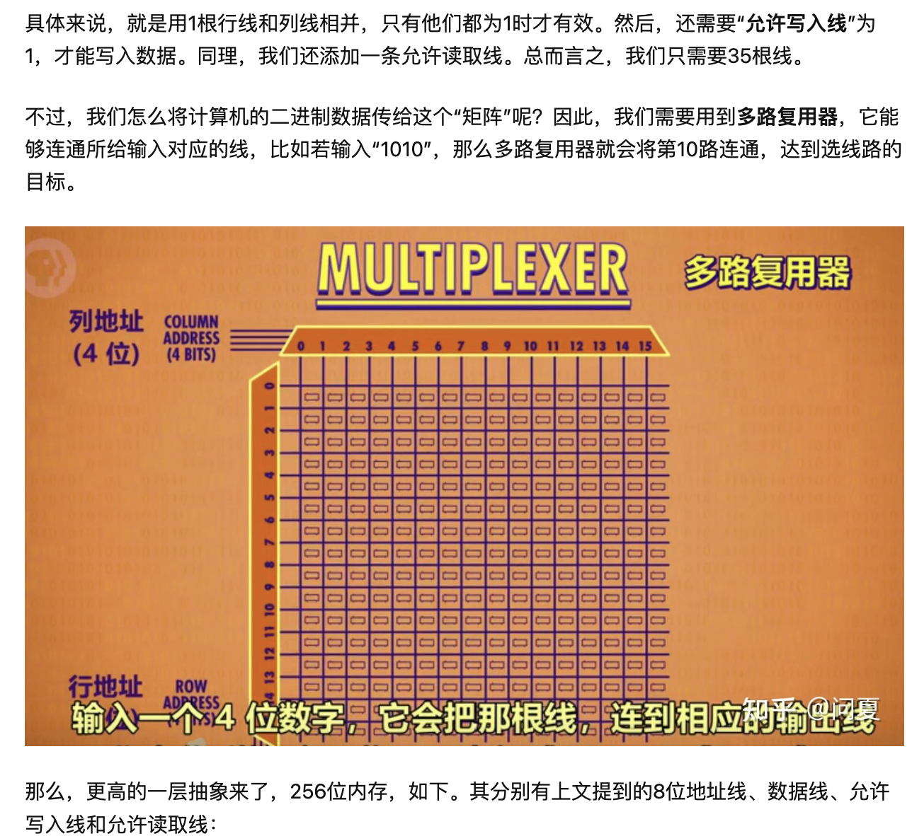
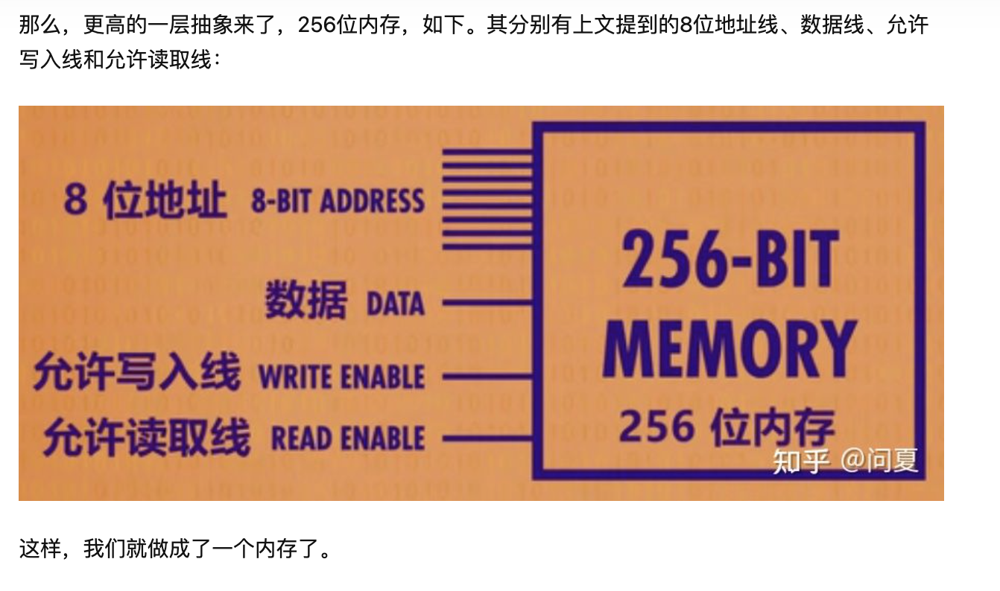

- → 抽象：固化 0 和 1 的电路
- → 锁存器(AND-OR Latch → Gated Latch)
- {:height 235, :width 342}{:height 235, :width 342}
- 1 存储的分类
	- 内存 RAM(随机存取存储器)：在有电的情况下才能存储
	- 持久存储：
- 2 存储 1 个位(锁存器 AND-OR Latch)
	- {:height 290, :width 584}
	- 
	- 结合出：AND-OR LATCH 锁存器
	  
	- 两个输入，分别是“设置”和“复位”(由上而下)
		- | 设置 | 复位 | 输出 |
		  |---|---|---|
		  | 0 | 0 | 0 |
		  | 1 | 0 | 1 |
		  | 0 | 1 | 0 |
		  | 1 | 1 | 0 |
	- Gated latch 门锁
		- 数据输入：0 或 1
		- 允许写入：0 或 1
		- 
- 3 寄存器 存储
	- 一组锁存器组成寄存器(8 位、16 位、32 位、64 位。。。)
	- 
	- 
	- 
	- 
	- ## 结论
		- 1、寄存器，很小的一块内存。能存一个Byte。
		- 2、RAM，一大块内存，可以存取很多数据。
	- ## Refer
		- [寄存器和内存](https://zhuanlan.zhihu.com/p/397341919)
	-
	-
	-