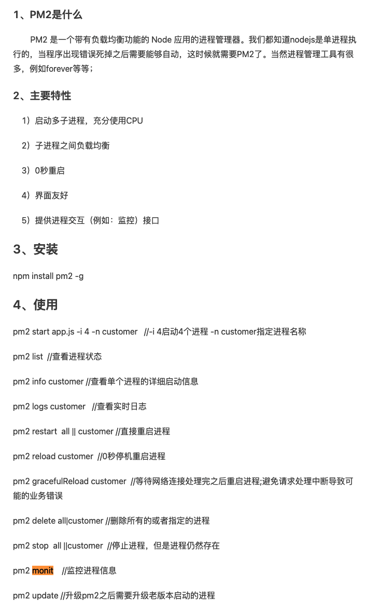

- ### 后端架构
	- 1. 传统分层架构
	  	1. 后端一个应用，MVC 模型等；
	- 2. 微服务 
	  1. 按工程拆分很很多服务模块，分布式部署，服务间远程过程调用 (RPC)
	- 3. 云服务
	  	1. Iaas 基础设施服务，买存储、CPU 等基础设施，基本按月付费
	  	2. Paas 平台即服务 在机器上增加操作系统和一些基础软件，用户在上边自行开发
	  	3. Saas 软件即服务，直接提供云软件服务，在 Paas 的基础上，把自己要出售的软件安装好，提供软件服务
	- 4. 容器化
	  	1. 云原生的概念，Cloud Native
	  	2. 容器化和虚拟机的区别
	- 5. 虚拟机，在物理机上安装，且需要安装操作系统（操作系统需要占用很多资源
	- 6. 容易化，虚拟机的一种，不需要安装操作系统，直接对接 CPU 和存储等
	  	1. 虚拟机 Docker
	  	2. 虚拟机编排技术 K8s
	- 7. Serverless
	  	1. 直接由容器控制，扩容和伸缩跟随容器
- ### 软件运维
  	1. CI 持续集成：在提交的时候，自动编包和测试，保证提交的代码都是可用的
  	2. CD 持续交付： 把编好的包，自动分发到生产环境，但是线上还是指向原来的包
  	3. CD 持续部署：将线上运行的包，切包的新包
- ### NodeJS进程守护工具
  	PM2：守护正常进程工作的进程，比如当正常进程意外挂了，自动重启。
  