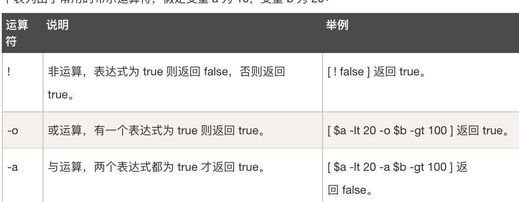
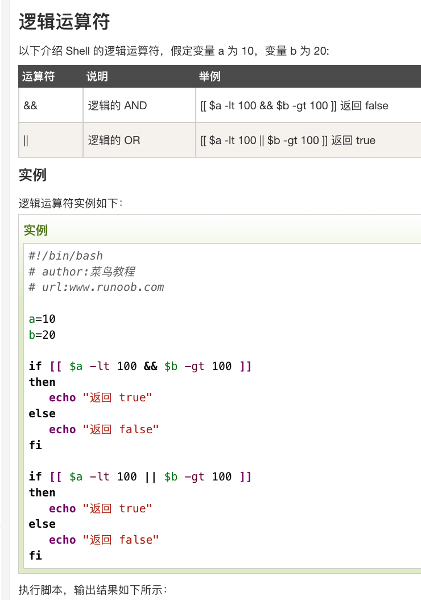
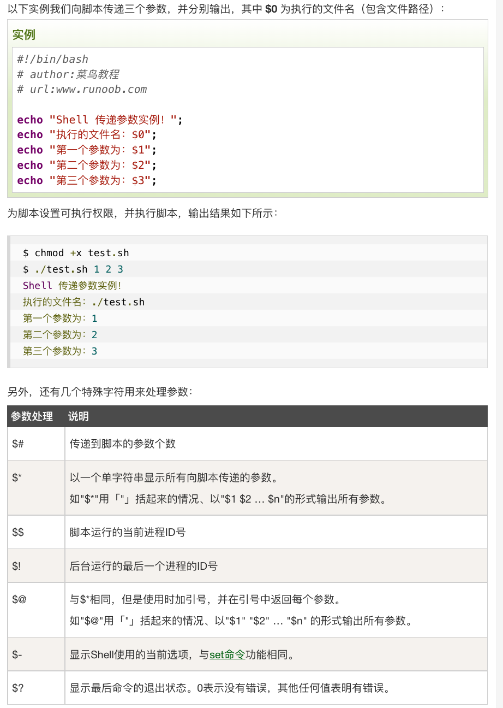
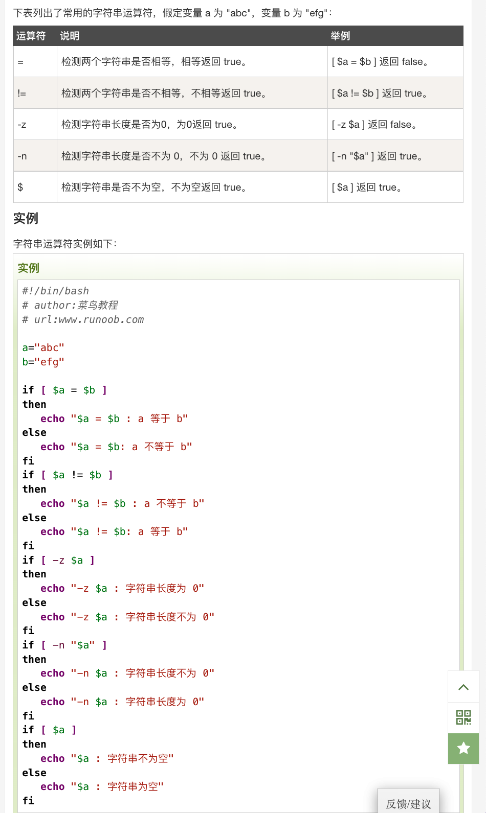
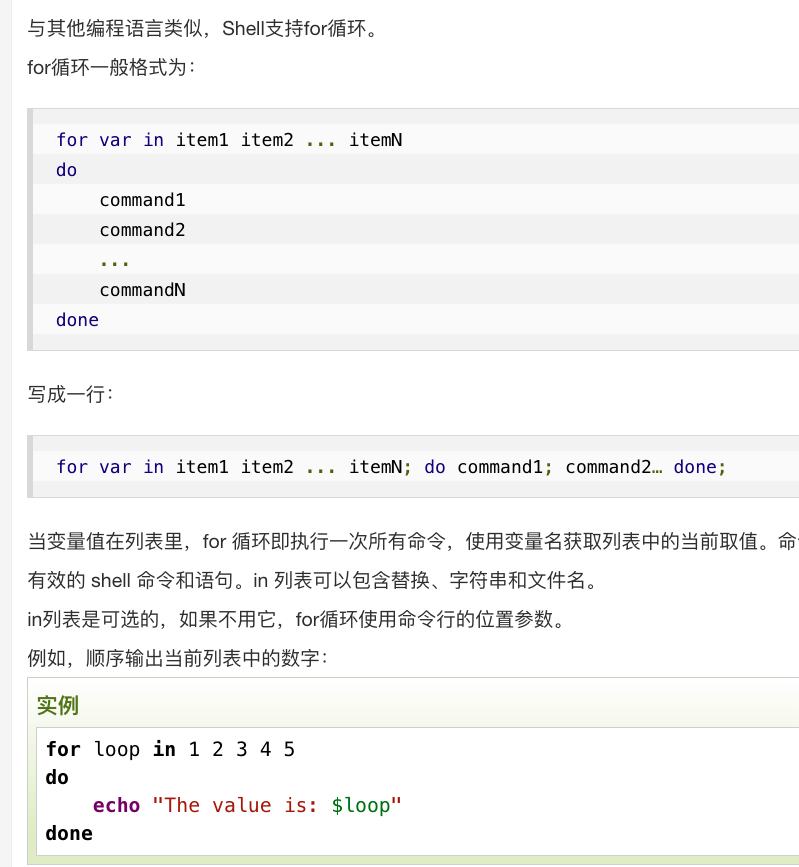
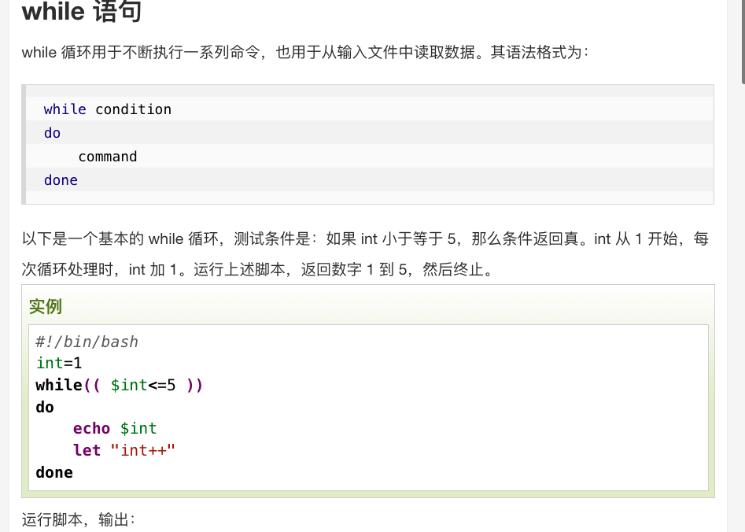
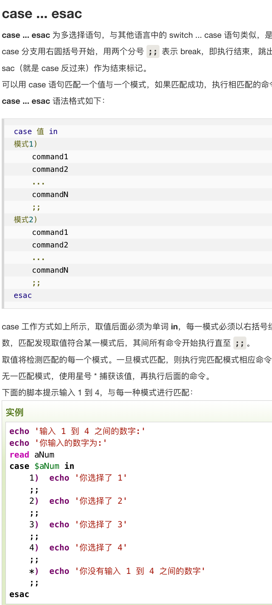
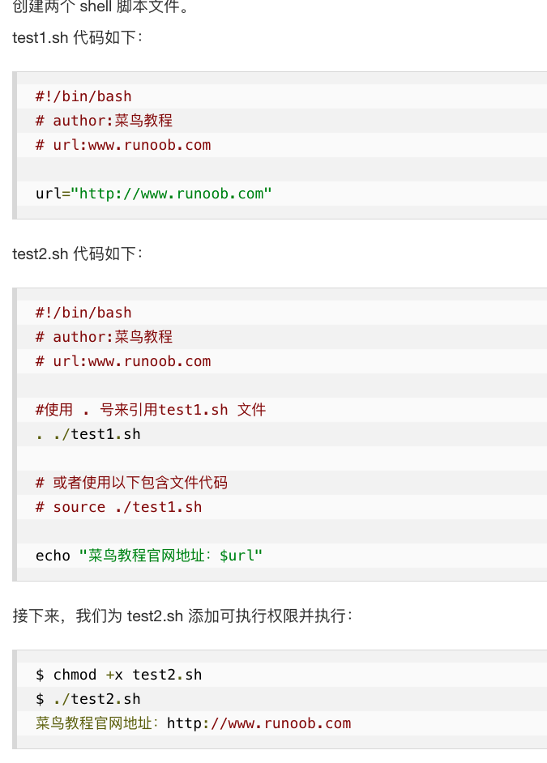

- Content From [[MIT-Missing-Semester Abstract]]
	- `$PATH`和执行逻辑
		- 命令查找
			- 系统 shell，从`$PATH`中查找，比如运行`$ls`命令
			- `$./x/path/ls`，从指定位置执行二进制
		- 解释权
			- 文件顶部写有`#!/bin/bash`，然后`./cmd.sh`，则使用顶部解释权执行。
			- `$/bin/sh ./cmd.sh`，指定解释权指定(忽略文件顶部声明)
	- 变量
		- 赋值与读取
			- `your_name="alucard"; echo ${your_name}`
			- `for file in $(ls /etc)`
			- `"my name is ${name}"`
		- 字符串
			- 单引号原样输出
		- 数组
			- 数组名=(值1 值2)
			- arr[0]=xxx
		- 运算符
			- 算数 `expr`
			- ```shell
			  a=10
			  b=20
			  
			  val=`expr $a + $b`
			  echo "a + b : $val"
			  
			  val=`expr $a - $b`
			  echo "a - b : $val"
			  
			  val=`expr $a \* $b`
			  echo "a * b : $val"
			  
			  val=`expr $b / $a`
			  echo "b / a : $val"
			  
			  val=`expr $b % $a`
			  echo "b % a : $val"
			  
			  if [ $a == $b ]
			  then
			     echo "a 等于 b"
			  fi
			  if [ $a != $b ]
			  then
			     echo "a 不等于 b"
			  fi
			  ```
		- 逻辑运算符
			- ```shell
			  a=10
			  b=20
			  
			  if [ $a -eq $b ]
			  then
			     echo "$a -eq $b : a 等于 b"
			  else
			     echo "$a -eq $b: a 不等于 b"
			  fi
			  if [ $a -ne $b ]
			  then
			     echo "$a -ne $b: a 不等于 b"
			  else
			     echo "$a -ne $b : a 等于 b"
			  fi
			  if [ $a -gt $b ]
			  then
			     echo "$a -gt $b: a 大于 b"
			  else
			     echo "$a -gt $b: a 不大于 b"
			  fi
			  if [ $a -lt $b ]
			  then
			     echo "$a -lt $b: a 小于 b"
			  else
			     echo "$a -lt $b: a 不小于 b"
			  fi
			  if [ $a -ge $b ]
			  then
			     echo "$a -ge $b: a 大于或等于 b"
			  else
			     echo "$a -ge $b: a 小于 b"
			  fi
			  if [ $a -le $b ]
			  then
			     echo "$a -le $b: a 小于或等于 b"
			  else
			     echo "$a -le $b: a 大于 b"
			  fi
			  ```
		- 布尔运算符
			- 
			- ```shell
			  a=10
			  b=20
			  
			  if [ $a != $b ]
			  then
			     echo "$a != $b : a 不等于 b"
			  else
			     echo "$a == $b: a 等于 b"
			  fi
			  if [ $a -lt 100 -a $b -gt 15 ]
			  then
			     echo "$a 小于 100 且 $b 大于 15 : 返回 true"
			  else
			     echo "$a 小于 100 且 $b 大于 15 : 返回 false"
			  fi
			  if [ $a -lt 100 -o $b -gt 100 ]
			  then
			     echo "$a 小于 100 或 $b 大于 100 : 返回 true"
			  else
			     echo "$a 小于 100 或 $b 大于 100 : 返回 false"
			  fi
			  if [ $a -lt 5 -o $b -gt 100 ]
			  then
			     echo "$a 小于 5 或 $b 大于 100 : 返回 true"
			  else
			     echo "$a 小于 5 或 $b 大于 100 : 返回 false"
			  fi
			  ```
		- 逻辑运算符
			- 
	- 脚本传参
		- 
	- 字符串
		- 
	- 控制流
		- 判断 test 命令
			- ```shell
			  cd /bin
			  if test -e ./notFile -o -e ./bash
			  then
			      echo '至少有一个文件存在!'
			  else
			      echo '两个文件都不存在'
			  fi
			  ```
		- if...else`if [ $(ps -ef | grep -c "ssh") -gt 1 ]; then echo "true"; fi`
			- ```shell
			  if [ $a == $b ]
			  then
			     echo "a 等于 b"
			  elif [ $a -gt $b ]
			  then
			     echo "a 大于 b"
			  elif [ $a -lt $b ]
			  then
			     echo "a 小于 b"
			  else
			     echo "没有符合的条件"
			  fi
			  ```
		- for
			- 
		- while
			- # [运行shell脚本时报错"\[\[ : not found"解决方法](https://www.cnblogs.com/han-1034683568/p/7211392.html)
			- 
		- case
			- 
	- 函数
		- 定义函数，在脚本中调用
		- ```shell
		  #!/bin/bash
		  
		  demoFun(){
		      echo "这是我的第一个 shell 函数!"
		  }
		  echo "-----函数开始执行-----"
		  demoFun
		  echo "-----函数执行完毕-----"
		  
		  ```
	- 输入输出流和管道
		- [shell 1>&2 2>&1 &>filename重定向的含义和区别](https://cloud.tencent.com/developer/article/1139965#:~:text=%3E%262%20%E5%8D%B31%3E%26,%E7%9C%8B%E4%B8%8D%E5%88%B0%E4%BB%BB%E4%BD%95%E4%BF%A1%E6%81%AF%E3%80%82)
	- 常用命令
		- echo
		- printf
		-
	- 脚本
		- 脚本之间的相互引用
			- 
	- _1654262965839_0.pdf)
	- [[HW-SHELL(MIT-Missing-Semester)]]