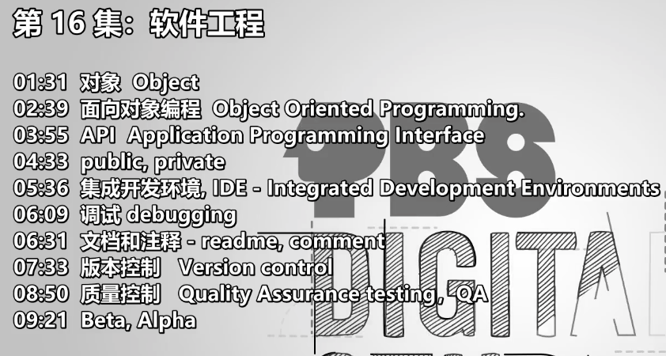

- 
- 对象 Object
- 面向对象编程 Object Oriented Programming.
	- 将和某个事物相关的function 放在一起
	- 核心是：==隐藏复杂度，选着性的公布功能==
- API Application Programming Interface
- public, private
- 集成开发环境, IDE - Integrated Development Environments
- 调试 debugging
- 文档和注释 - readme, comment
- 版本控制 Version control
- 质量控制 Quality Assurance testing，QA
- Beta, Alpha
	- Beta: 接近完成的版本，可部分外侧
	- Alpha： 很粗糙和很多错误，一般用于内部测试