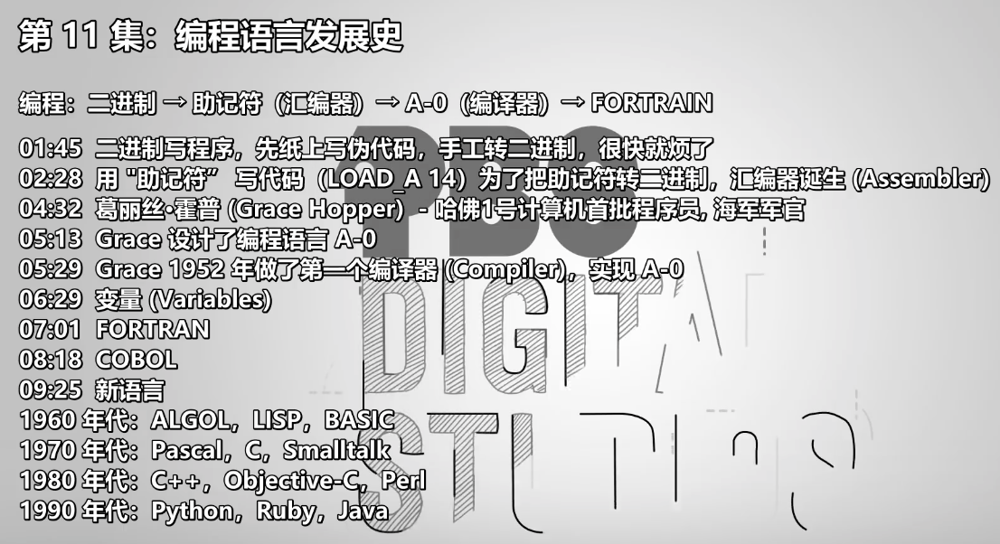
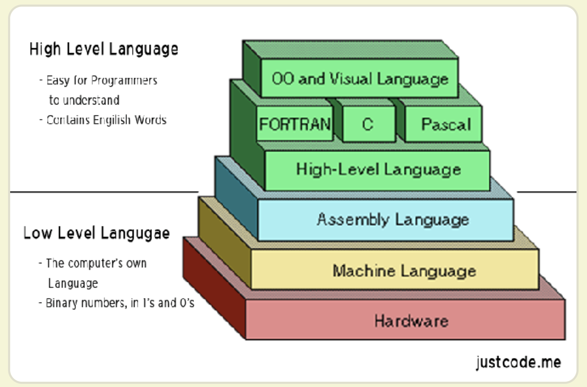
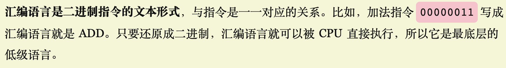

- 
- 
- 打孔机：二进制 Binary，每个指令由(操作符地址+目标数据地址组成)
- 助记符(汇编器)
	- 如果将指令(0101 1111)前 4 位的操作地址改成 Load_a这种可读文字，编程将会轻松很多
	- 所以助记符是`Load_a 1111`这个样子
	- 计算机如何识别`load_a`呢，就是汇编器
		- 
	- [汇编语言入门教程](https://www.ruanyifeng.com/blog/2018/01/assembly-language-primer.html)
- 编译器
	- 将高级语言编译成低级语言