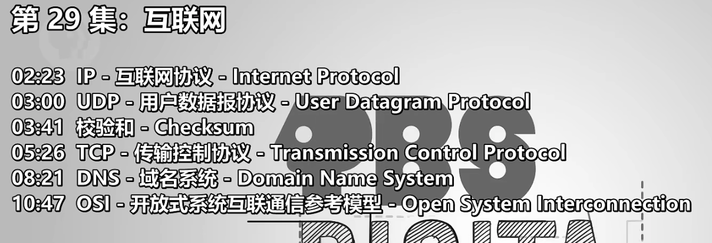
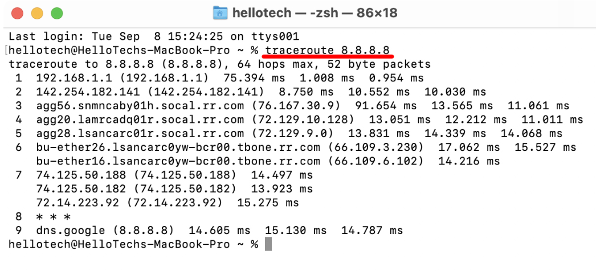
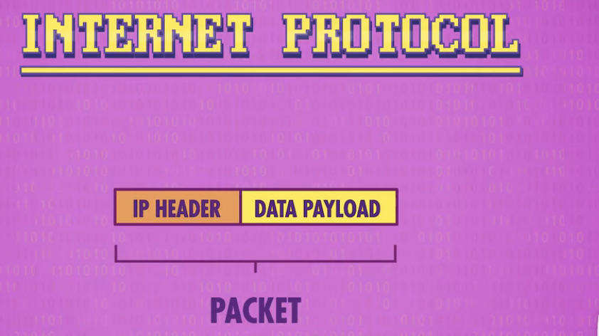
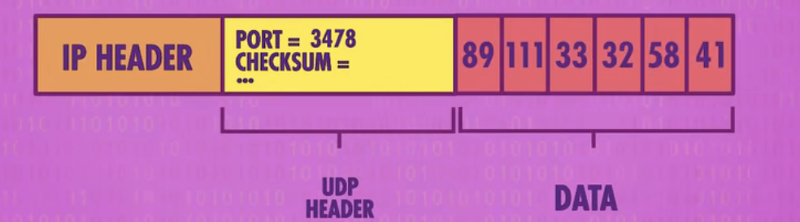
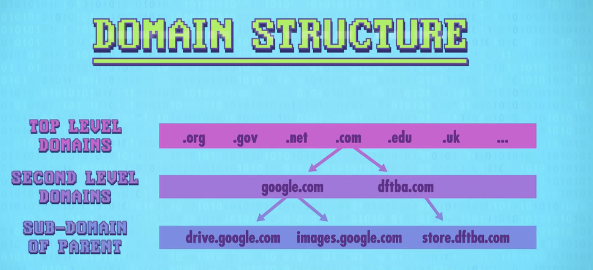
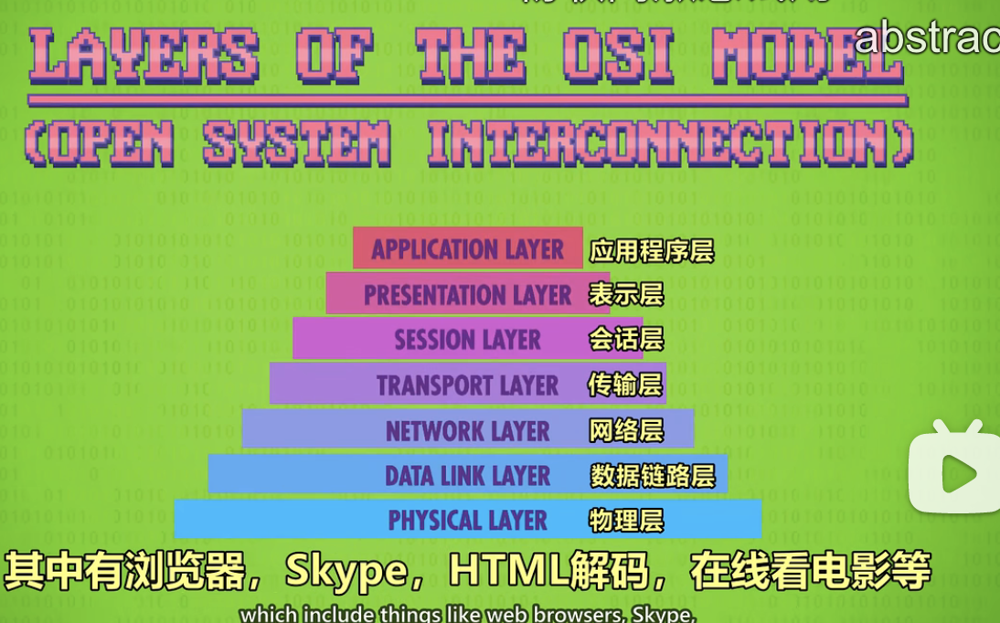

- 
- 网络层级
	- LAN
	- WAN(广域网 Wide Area Networks)
		- ISP (Internet Service Provider)，比如联通啥的
		- `traceroute` 命令，可以看到你本地到特定 IP 所需要的交换机(switch)跳转数
		  
- IP (Internet Protocol)
	- 负责把数据从一台机器传输给网络上的另一台机器
	- 
- 送到对方机器了，如何数据识别该给哪个程序
	- UDP (User Datagram Protocol)
		- 
		- 头部里有目标机器的端口信息
		- 校验和 Checksum
		- 不可靠，但又简单又快
- 
	- TCP Transmission Control Protocol
- DNS Domain Name System
	- domain 2 IP:port
	- 
- OSI Open System Interconnection
	- 
-