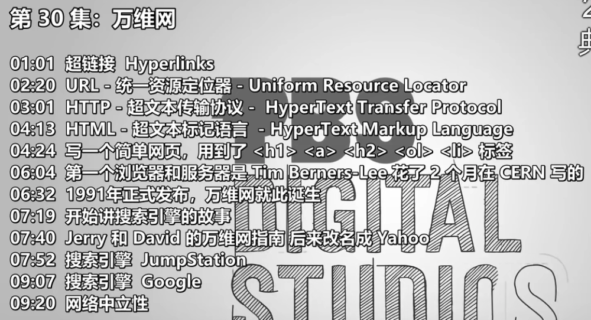

- 
- 超链接 Hyperlinks
- URL - 统一资源定位器 - Uniform Resource Locator
- HTTP - 超文本传输协议 - HyperText Transfer Protocol
- HTML - 超文本标记语言 - HyperText Markup Language
- 写一个简单网页，用到了 <h1> <a> <h2> <ol> <li> 标签
- 第一个浏览器和服务器是 Tim Berners-Lee 花了 2 个月在 CERN 写的
- 1991年正式发布，万维网就此诞生
- 开始讲搜索引擎的故事
- Jerry 和 David 的万维网指南 后来改名成 Yahoo
- 搜索引擎 JumpStation
- 搜索引擎 Google
- 网络中立性
-