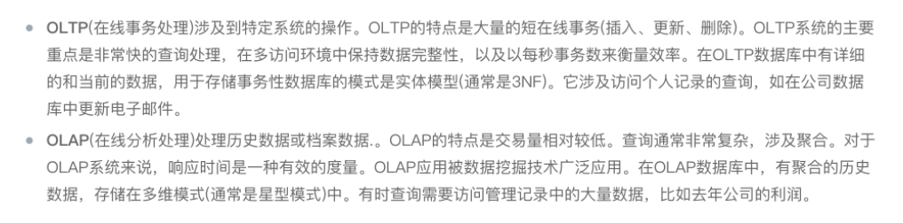
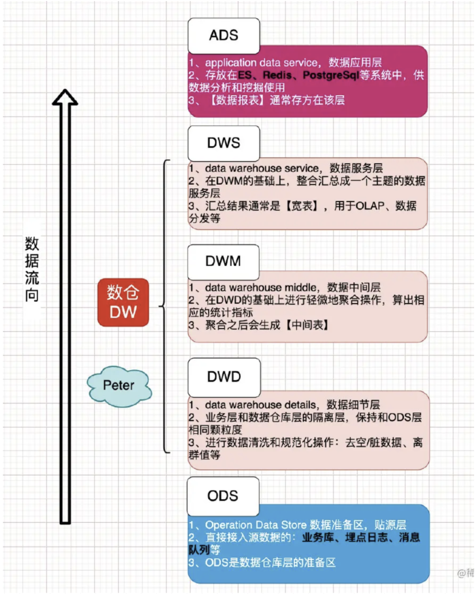

- #术语表
	- ```
	  ### 互联网
	  
	  IT =  信息技术(information tech)
	  
	  DT = 数据技术(data tech)
	  
	  电商企业 6 大管理系统
	  
	  - CRM(Customer Relationship Management)即客户关系管理
	  - ERP(Enterprise Resource Planning)即企业资源计划，这里特指电商行业的ERP。它是从MRP(物料需求计划)发展而来的新一代集成化管理信息系统。即管理公司有哪些资源（硬件、人、客户、资产等），再智能化帮助做决策。采购-行政-hr 使用。
	  - OMS(英文Order Management System)即订单管理系统。
	  - WMS(英文Warehouse Management System)即仓库管理系统。
	  - SRM是Supplier Relationship Management的缩写，即供应商关系管理。
	  - BPR(business process reengineering)业务流程重组、企业流程再造。
	  
	  IoT = 物联网（The Internet of Things，简称*IoT*）*是:* 指将日常物理对象连接到互联网的过。
	  
	  OA = 办公自动化（Office Automation）
	  
	  DCMM = 数据管理能力成熟度模型（Data ctrl Management mode)
	  
	  ### 软件过程
	  
	  SRS=需求分析文档（Software Requirements Specification)
	  HLD=概要设计文档（High Level Design）
	  LLD=详细设计文档（Low Level Design）
	  BD=基本设计（Base Design）
	  DD=详细设计（Detailed Design）
	  FD=结构设计（Functional Design）
	  UT=单元测试（Unit Test）
	  IT=集成测试（System Integration Test）
	  ST=系统测试（System Test）
	  UAT =用户接受测试(俗称:验收测试)（User Acceptance Test）
	  
	  Milestone = 里程碑
	  
	  TO = Technical Owner
	  
	  ROI = 投入产出比 （Return on Investment）
	  
	  FL = (Feature Lead)
	  
	  DDD = Domain Driven Design
	  
	  ### 大数据
	  
	  **ETL = 数据清洗（**Extract-Transform-Load ）
	  
	  - 用来描述将数据从来源端经过抽取（extract）、转换（transform）、加载（load）至目的端的过程。 **ETL**一词较常用在数据仓库，但其对象并不限于数据仓库。
	  - 联机分析处理*OLAP*（OnLine Analytical Processing，读取数据）和联机事务处理OLTP（OnLine Transaction Processing，增删改数据）。
	  
	  
	  
	  ### 数仓分层
	  
	  
	  
	  ### B.O.S 数据
	  
	  JD = 数据收集服务（jdatacollector）
	  
	  event
	  
	  - 解释：事件/行为/动作。eg: SDK *启动*这一个事件。
	  - 上报事件有两套：thrift，protobuf
	  - 目前只管理 protobuf 的所有 event，对于 thrift，目前不会增加不会做管理，后续可能会导入不可修改
	  
	  counter
	  
	  - 解释：统计值。eg: 视频渲染时, 在xxx中的*丢帧率*。
	  
	  voqa（基本上不会改变，目前只有一个）
	  
	  - 解释：voice quality。现在范指网络传输质量，包含音频。
	  ```
	- 
	- 