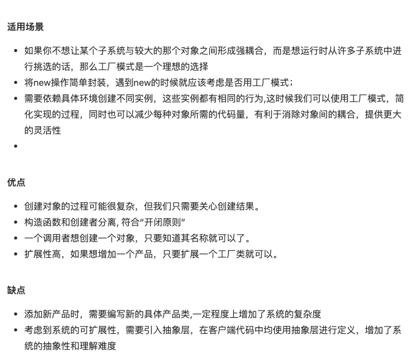

- 解释
  定义一个*创建对象时*，可以选择创建具体什么对象。
  
  创建一个工厂对象，然后再又工厂对象决定具体创建什么对象。
  
  当你用到 new 的时候，就可以考虑是否适用于工厂模式。
  
  适用场景：
   
  case:
  比如一个页面，下边有可以左右滑动的 chart。
  那么我们会选择懒加载，或者根据 URL 中 query 的参数选择初始化加载图标。
  这一类的 charts 就可以抽象出工厂，存放 create chart instance 的方法和相关工具。
  
  ```javascript
  class Chart {
    constructor(id) {
      this.id = id;
    }
  
    init() {
      // init chart by id
    }
  
    func() {
      console.log(this.id);
    }
  }
  
  class ChartFactory {
    // 增加单例模式，id 对应的 chart 只创建一次
    // constructor() {
    //   this.chartMap = {}
    // }
  
    createChart(chartId) {
      // this.chartMap[chartId] = this.chartMap[chartId] || new Chart(chartId)
      return this.chartMap[chartId];
    }
  }
  
  function pageInit() {
    let chartId = getDefaultChartIdFromQuery();
  
    const factory = new ChartFactory();
    let chart = factory.createChart(chartId);
    chart.func();
  }
  
  pageInit();
  ```
  
  存在的问题，需要额外建立 Factory 的类，增加的代码的复杂度。
- 定义一个*创建对象时*，可以选择创建具体什么对象。
  
  创建一个工厂对象，然后再又工厂对象决定具体创建什么对象。
  
  当你用到 new 的时候，就可以考虑是否适用于工厂模式。
  
  适用场景：
   
  case:
  比如一个页面，下边有可以左右滑动的 chart。
  那么我们会选择懒加载，或者根据 URL 中 query 的参数选择初始化加载图标。
  这一类的 charts 就可以抽象出工厂，存放 create chart instance 的方法和相关工具。
  
  ```javascript
  class Chart {
    constructor(id) {
      this.id = id;
    }
  
    init() {
      // init chart by id
    }
  
    func() {
      console.log(this.id);
    }
  }
  
  class ChartFactory {
    // 增加单例模式，id 对应的 chart 只创建一次
    // constructor() {
    //   this.chartMap = {}
    // }
  
    createChart(chartId) {
      // this.chartMap[chartId] = this.chartMap[chartId] || new Chart(chartId)
      return this.chartMap[chartId];
    }
  }
  
  function pageInit() {
    let chartId = getDefaultChartIdFromQuery();
  
    const factory = new ChartFactory();
    let chart = factory.createChart(chartId);
    chart.func();
  }
  
  pageInit();
  ```
  
  存在的问题，需要额外建立 Factory 的类，增加的代码的复杂度。