- ### 2022
	- 使用卡片笔记，收集零碎信息，日日清-整理
	- 尝试时间切割，来管理自己的职业方向
	- 训练自己的工作沟通方式-交流
	  * 知道你想说什么：说之前规划你想说的东西，列出大纲。问自己：这是否讲清楚了我要说的东西。然后提炼
	  * 了解听众：了解听众的需要、兴趣、能力
	  * 选择表达的时机
	  * 选择交流风格：简报、详细报道
	  * 让文档美观
	  * 让听众参与：在制作文档的过程中，让听众参与、反馈
	  * 做倾听者
	  * 回复他人：可以电子邮件什么的
	- 建立自己的英语阅读能力
		- 电子词典-方便查询、收藏-多平台同步-pipeline 到 anki 被复习
		- Alfred 关键词 t 调用自带词典。（带耳机，需要方便发音和听取）
	- 使用 VIM 编程
- ### 环境/业务
	- 理解自己工作的语境
	- 建立自己的知识资产
		- 严肃的投资者定期投资-作为习惯
		- 多元化是长期成功的关键
			- 知道各种技术，以及特征、关系图
		- 聪明的投资者在保守的投资和高风险、高回报的投资之间平衡他们的资产
			- 不要把所有的技术放在同一个篮子里
		- 投资者设法低买高卖，以获取最大的回报
			- 在新兴技术流行之前学习它
		- 应周期性的重新评估和衡量资产
		- 目标
			- 定期尝试新技术
			- 每季度阅读一本技术书籍
			- 也阅读非技术书籍
			- 上课，可以是网课
			- 参加本地用户组织
			- 体验不同的工作环境
			- 跟上潮流：看最新的 paper 和技术文章
- ### 编码哲学
	- 向着熵减的方向出发
	- 启动杂役
	- 好软件的要素
		- 让用户参与权衡（定义系统要做到的范围、程度、质量
		- 知道何时止步
- ### 项目管理
	- 分析责任、控制能力、风险
	- 批判的思考：技术适用、还是不适用于你的项目
- ### 工程实践
	- DRY
	- 正交性：消除无关事务之间的影响
	- 可撤销性：设计成让代码组件随时可被取代
	- 快速试错，结果先行：曳光弹
	- 制作原型 | 模型 | demo：明确这些代码是用过就丢，是为了验证
	- 领域语言
		- 使用靠近领域的语言解决问题
		- 学习一些领域语言、小型语言
	- 估算
		- 使用不同单位，表示不同场景
		- 先建模，再估算
			- 确定问题的范围
			- 模型拆分成组件（每个组件有一些参数）
			- 给每个参数定值
			- 计算答案
			- 追踪自己的估算能力
			- 估算项目进度
				- 检查需求
				- 分析风险
				- 设计、实现、集成
				- 向用户确认
				- 在被要求进行估算的时候说什么：我等会儿回答你
			- 写估算日志，计算每一次估算的精度
	- Shell 的威力
	- 源码控制：Git 以及私有化部署
	- 调试
		- 找出问题的根源，而不是特定表现
		- 把编译器告警设置的尽量高，并获取一手现场
		- 让 Bug 现场更同意再现
		- 一些调试器、客户端具有数据可视化能力，善用他们。比如 SQl的表关系
		- 调用追踪，二分法
		- 橡皮鸭：一步一步向自己解释，代码在做什么
		- 消除依赖的问题：当依赖的第三方、系统等出现问题，不要想着修改调用自己的代码去绕开它（因为更新后它自身修复了，而你污染了自己正确的代码。
	- 学习一门操作语言，去当做各种工具间的粘合剂
	- 代码生成器（生成代码、文档、API 等
		- 被动代码生成器：snippets 等
		- 主动代码生成器
- ### 解耦
	- 解耦与德墨忒尔法则：低沟通的组件编程
	- 元程序：将内容设计成可配置的原子项，有一个可以描述它的“元信息” -> 配置文件
	- 来自时间的耦合：时间入参、顺序发生、并发
		- 工作流分析： UML 时序图
		- 架构
		- 设计
		- 部署
- ### 重构  
  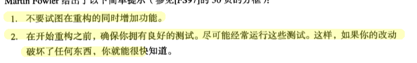 
  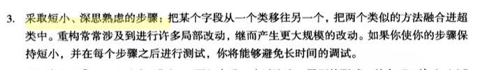 
  把一些规则，植入 IDE 或者 Lint 里。
  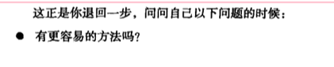
  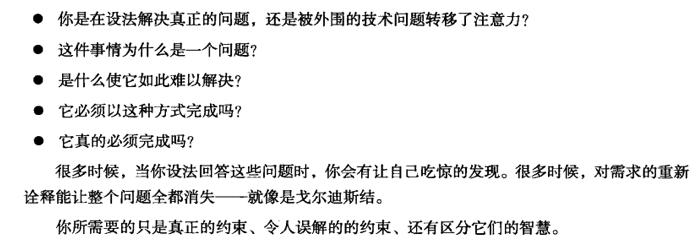
- ### 复习提纲
  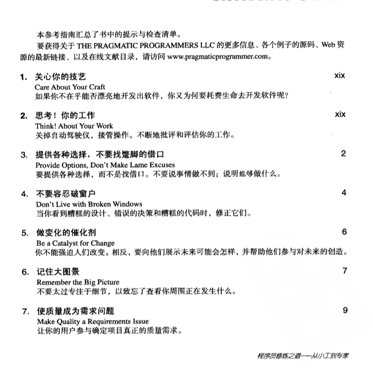
  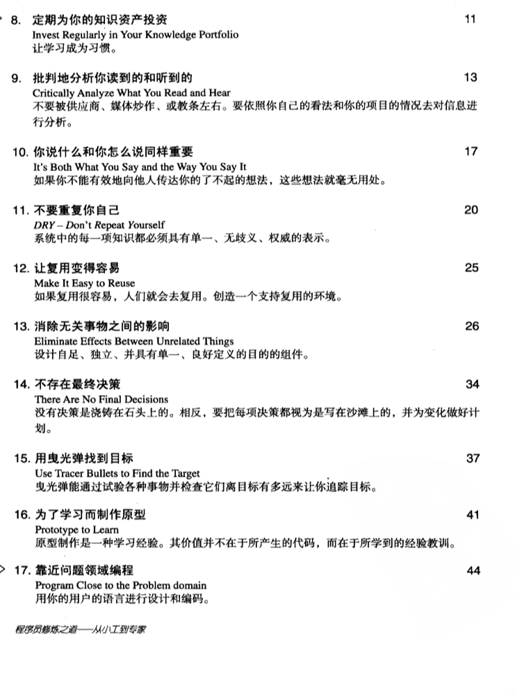
  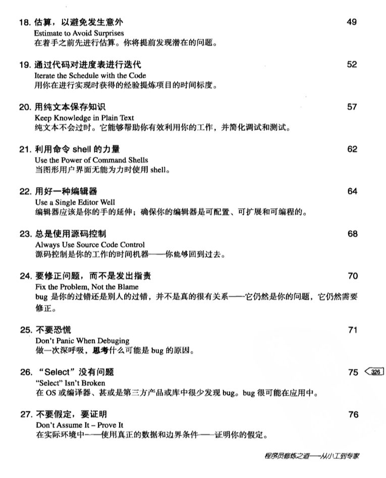
  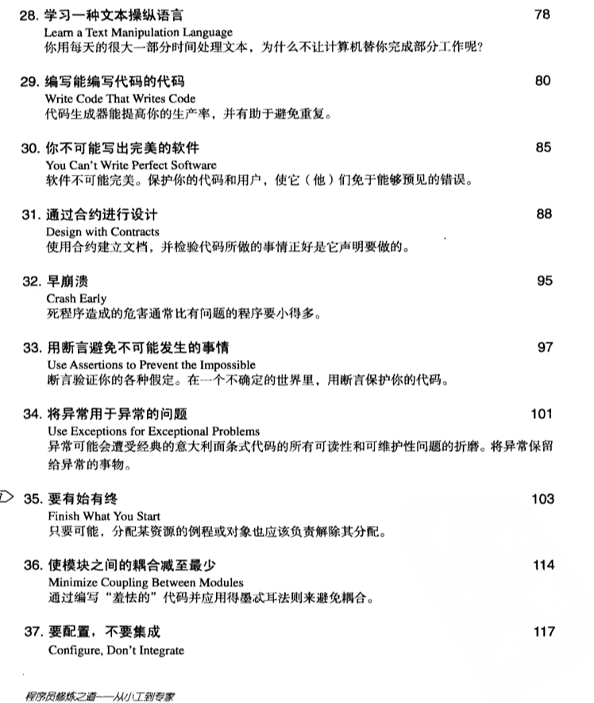
  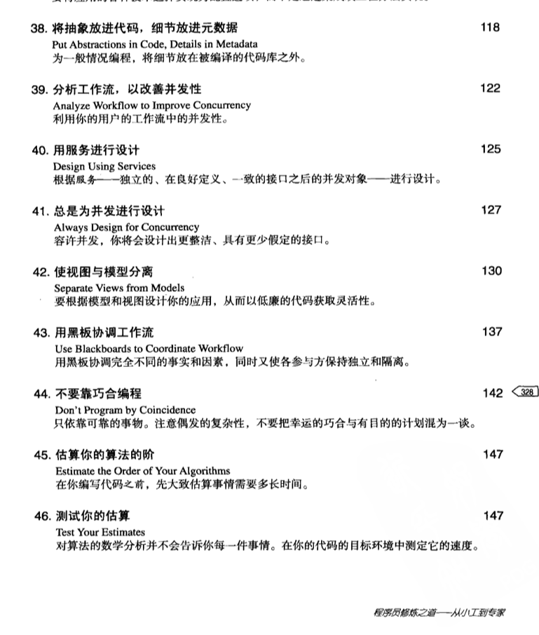
  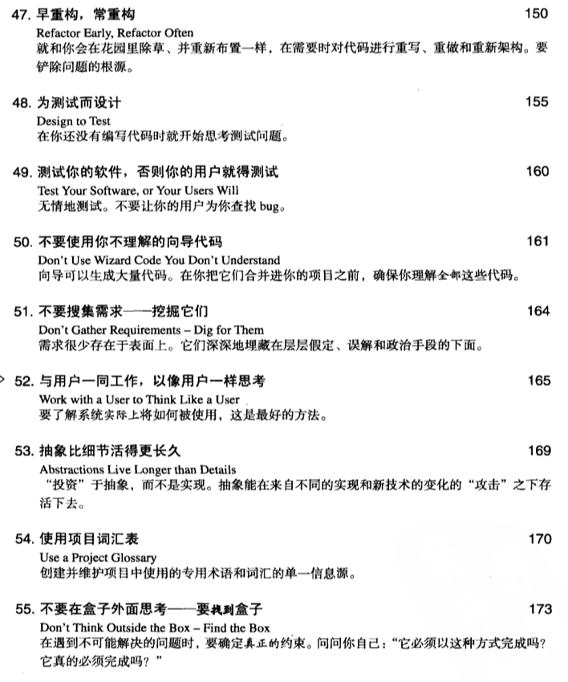
  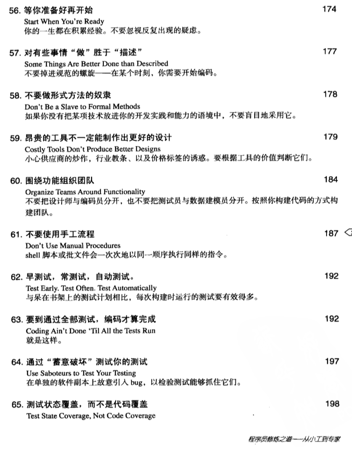
  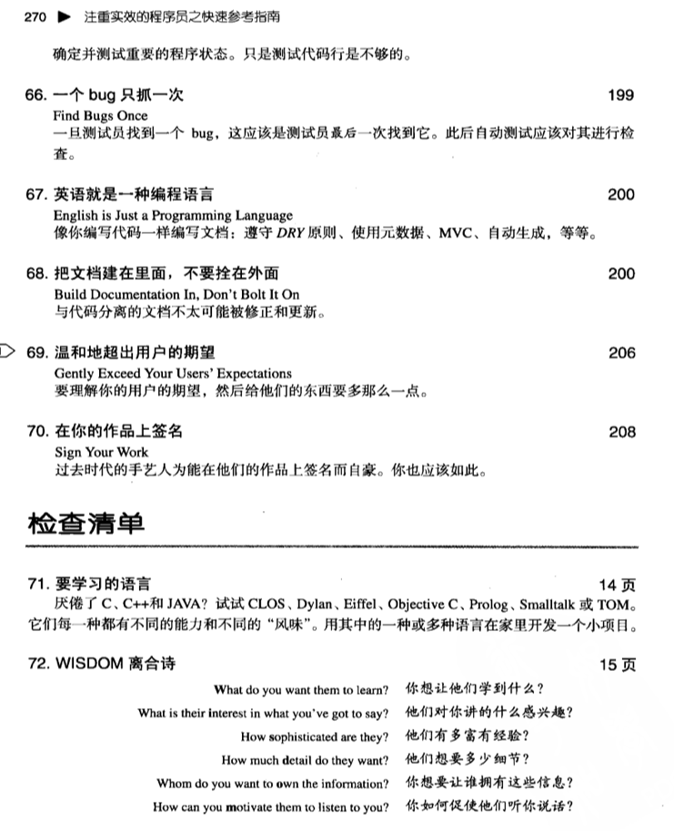
  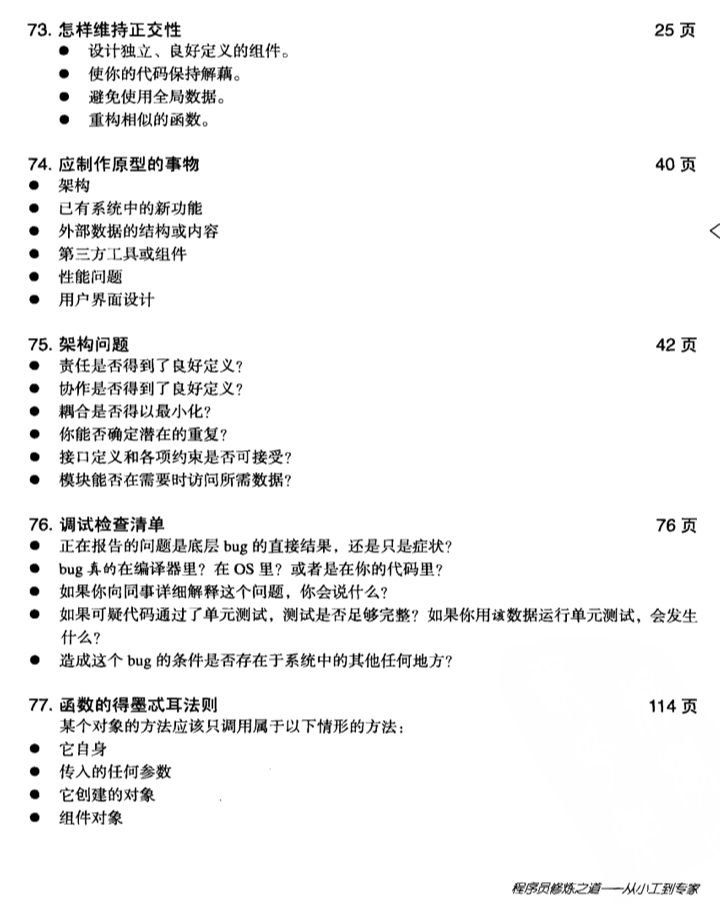
  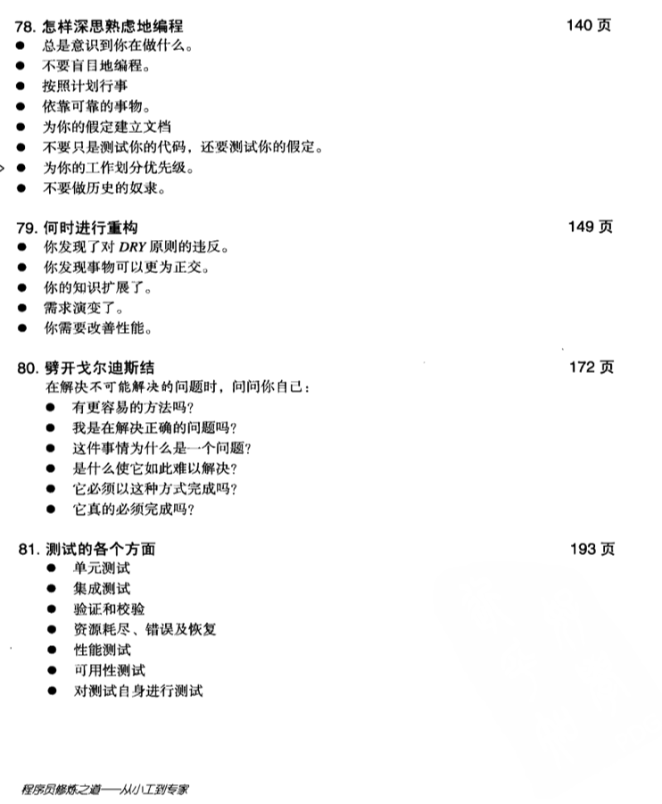