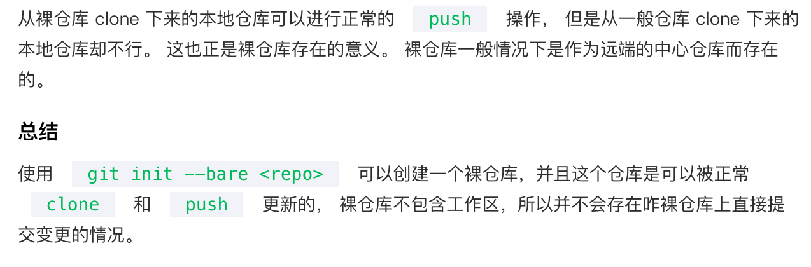

- 概念
	- 1、要知道当前学习的这门技术是一个`什么`东西？
		- git 包含 local 和 remote 两个端。这里是指的 remote。
	- 2、学习一种语言，或者技术框架、系统 等等..要知道它`为什么`存在,以及它的作用和应用场景？
		- Why: 中心协作，或者服务器发布代码。
	- 3、最后才是想办法如何去掌握其中重要的技术以及知识点？
- 底层数据模型和设计理念
	- 理念
		- remote 端，重的话可以使用 github、bitbucket、gitlab 等。
		- 轻量的话，可以搭建一个裸仓库。
		  
- 笔记
	- `git init --bare repo.git`，服务端仓库名，一般以 `.git` 作为后缀
- 参考
	- [搭建Git服务器](https://www.liaoxuefeng.com/wiki/896043488029600/899998870925664)
	- [Git 本地仓库和裸仓库](https://cloud.tencent.com/developer/article/1195852#:~:text=%E8%AF%A6%E7%BB%86%E8%AF%B4%E4%B8%80%E4%B8%8B%E4%BD%BF%E7%94%A8%20%2D%2D,%E4%B8%80%E8%88%AC%E4%BD%BF%E7%94%A8%E7%9A%84Git%20%E5%91%BD%E4%BB%A4%E3%80%82)