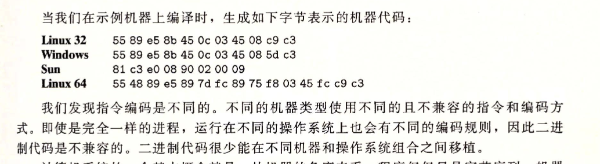
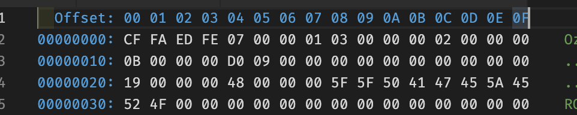

- > Representing and mnipulating information
  > 数字、其他基本类型的数学表示、存储结构、属性和运算。
- 数字、其他基本类型的数学表示、存储结构、属性和运算。
- ## 2.1 信息存储
  大多数机器使用 Byte 作为最小可寻址单位。机器级别程序将虚拟内存看成一个巨大的字节数组。
  每个 Byte 有一个唯一的数字表示，称为地址。
  *指针、引用这些概念都来自于地址*。
	- ### 2.1.1 十六进制
	  16 进制和 2 进制的转换很方便。
	  16 进制：0-9，A-F 组成。一位等于 2 进制的 4 位。
	  C 语言中，16 进制以 0x 开头。
	  Go 语言中
	  ```go
	  package main
	  
	  import "fmt"
	  
	  func main() {
	    a := 9                 // 10进制
	    fmt.Printf("%d \n", a) // 十进制 9
	    fmt.Printf("%b \n", a) // 二进制 1001
	  
	    b := 0xff
	    fmt.Printf("%x \n", b) // 16进制  ff
	  }
	  ```
	  Ability: 2、10、16进制之间的转换。
	  应用：可以用于打印出变量的 16 进制地址，判断传入函数是值复制还是指针传入。
	- ### 2.1.2 字数据大小
	  *32位机器和 64 位机器*
	  机器定义了一个参数，表示这个机器的位数。
	  CPU 和I/O 总线的数据寻址空间都遵循这个，比如都同时是 32 或者 64。
	  CPU 的 32 位，指可以一次处理 32bit (4Byte)的内容。
	    寻址空间，指的是一块管理内存位置的内存。32 位机器，能表示的虚拟地址范围是0~1^32-1。 因为只能管理这么多地址，而计算机里一个 Byte 拥有一个地址。所  以 32 位的最大内存大小为 2^32个 Byte，即 4Gi*B=4GB.
	- ### 2.1.3 寻址和字节顺序
	  两个规则：
	  1. 这个对象的地址是什么；
	  2. 在内存中如何排列这些 Byte；
	  -> 通常程序对象，在机器上被存储为连续的字节顺序，对象的地址是作用字节中最小的那个。
	  跨字节对象，排序方式有：*小端法、大端法*（仅仅方向相反）。
	- ### 2.1.4 表示字符串
	  简单的编码表 ASCII 或 UTF-8的映射。
	- ### 2.1.5 表示程序（程序的编码）
	  位数（32 位、64 位）、编码格式（ASCII、UTF-8）、大端法、小端法。
	  所以，源程序具有可移植性，.bin 文件没有。
	  Src -> 机器指令 -> binary -> 机器运行。
	  
	  *Question: 如何让代码在不同都可以运行？（可移植性）*
	  思路：在上边链路上如何一个环节插入就可以，
	  1. 让不同平台的机器指令，编译相同代码产出符合当前机器的运行（限制：需要提供出源代码…，无法满足 oem 等场景）
	  2. Binary 在裸机上跑，中间加一层 middleware，屏蔽不同 OS 和 Kernal 的差异（比 1 好）；
	  实际：
	  Java 采用了方法 2，JVM 就是这个 Middleware。
	   
	   
	  
	  
	  > 拓展: JavaScript 的执行过程
	    > [深入了解JavaScript执行过程（JS系列之一）_前端攻城狮-CSDN博客_javascript的运行过程](https://blog.csdn.net/wexin_37276427/article/ details/105028116)
	  ```
	  JS 的程序从源码到运行，分为两个过程：编译、执行
	  编译：词法分析 -> 语法分析 -> 代码生成二进制执行文件
	  执行：构造一个虚拟的环境（执行上下文），其实就是 JS 执行的规则和数据结构
	  
	  
	  Diff  JAVA
	  Java 的编译：词法分析 -> 语法分析 -> 语义检查 -> 代码优化和生成字节码（不是二进制，二进制还是要 JVM 搞一搞的）
	  Java 的执行：Binary 在 JVM 虚拟机中执行
	  
	  
	  过程解释：
	  词法分析：分词
	  语法分析：生成一个语法树 JSON （即 AST）。
	    JS 的代码生成：这一步由 chrome 引擎做。AST -> 字节码 -> 机器二进制指令。（PS: 为啥有一个中间字节码的过程，而不是直接二进制，是因为二进制太占空  间了）。https://z.itpub.net/article/detail/9ED13336A7AED4F574BEACAD195F2B14
	  ```
		- ### 2.1.6、2.1.7 布尔和位运算
		  	  布尔类型是一个基础的逻辑类型。
		  	  区分*位运算*和*逻辑运算*。
		  
		  	  位运算：
		  	  取反：~x
		  	  并：&
		  	  或：|
		  	  异或：^
		  	  为移运算： <<< >>>
		  	  -> 如果用位运算表示 a === b 逻辑。
		  	  -> 表示补集、并集
		  
		  
		  	  逻辑运算：
		  	  ！
		  	  &&
		  	  ||
		  	  二进制位的逻辑，全部 0 才是 false,非 0 就是 true。
		  	  位运算。
		- ## 2.2 整数表示
		  	  *无符号、带符号*
		  	  ```
		  	  Go 语言的整数类型
		  	  int8、int16、int32、int64
		  	  int 是等于int32 还是 64，由机器是 32 位还是 64 位决定。
		  	  ```
		  
		  	  * 位转无符号整数表示：B2U (Binary to Unsigned)
		  	  * 补码（即用第一位表示正负的位表示，1 表示负）：B2T
		  	  *已确定编码整数的扩展或者收缩*
		  	  * 强制类型转换
		  * 小转大（扩展）
		  * 大转小（截取）
		  * 有符号 - 无符号转换
- ## 2.3 整数运算
	- ### 2.3.1 无符号加法
	  当相加时不溢出，则是 a+b。
	  当溢出时，截掉溢出部分位。 = (a+b) mod 2^w
	- ### 2.3.2 补码加法
	- ### 2.3.3 补码的非
	  即对位 x，求~x。将所有的位变反。
	  比如 4 位，范围是-8~7，
	  所以在 -7到7间，是所有位取反，然后+1。
	  对于没有对应的-8 没有对应，所以-8 的还是-8。
- ## 2.4 浮点数
	- ### 2.4.1 二进制小数（浮点数的二进制表示）
	    所以二进制的精度是 1/2^n。二进制表示的是一个近似值，比如 1/3不能用1/2^ *t 表示，就会比近似到离其最近的二进制可以表示的浮点数值中去。
	  
	    问题：当近似累计次数非常之多时，微小的错误就会被巨大化。
	- ### 2.4.2 IEEE 浮点表示