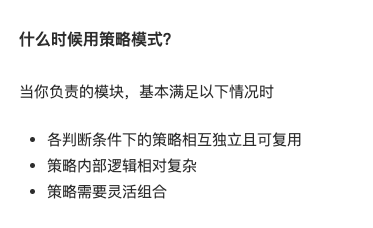

- > 定义: 根据不同参数可以命中不同的策略
- 观察如下获取年终奖的 demo, 根据不同的参数（level）获得不同策略方法(规则), 这是策略模式在 JS 比较经典的运用之一。
  
  ```javascript
  const strategy = {
  ’S’: function(salary) {
    return salary * 4
  },
  ‘A’: function(salary) {
    return salary * 3
  },
  ‘B’: function(salary) {
    return salary * 2
  }
  }
  - const calculateBonus = function(level, salary) {
  return strategy[level](salary)
  }
  - calculateBonus(‘A’, 10000) // 30000
  ```
  
  在函数是一等公民的 JS 中, 策略模式的使用常常隐藏在高阶函数中, 稍微变换下上述 demo 的形式如下, 可以发现我们平时已经在使用它了, 恭喜我们又掌握了一种设计模式。
  
  ```javascript
  const S = function(salary) {
  return salary * 4
  }
  - const A = function(salary) {
  return salary * 3
  }
  - const B = function(salary) {
  return salary * 2
  }
  - const calculateBonus = function(func, salary) {
  return func(salary)
  }
  - calculateBonus(A, 10000) // 30000
  ```
  
- 和工厂模式 diff_
  工厂模式是创建型模式，策略模式是行为模式。
  都是先准备一系列独立、解耦、可复用的方案。在具体创建、行为时，去选择使用一个或者多个的组合，去实现。
  本质，都是依赖注入（DI），使用者本身是一套抽象出来的模式，注册列表是一系列解耦的模块。通过将模块通过参数，注入到模式方法中，表现成某个具体的行为。