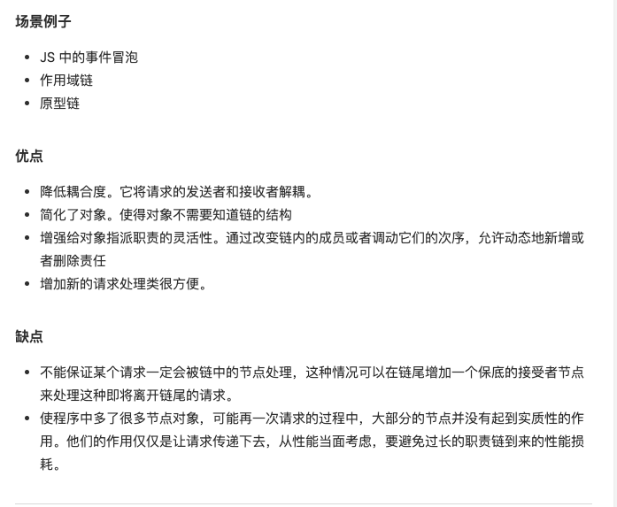

- 模式解释
  当一长串流程代码（模块），有明显的前后顺序。而且每个环节都是独立的时候，使用责任链来做。
  比如 A() -> B() -> C()，可能会有层层嵌套，后者依赖于前者结果的问题，也可能存在异步调用的问题。
  Promise 就是一个很好用的东西。
  除了常规的使用它最为异步的操作，还可以作为常规的同步操作。
  ```javascript
  // 请假审批，需要组长审批、经理审批、总监审批
  class Action {
    constructor(name) {
      this.name = name;
      this.nextAction = null;
    }
    setNextAction(action) {
      this.nextAction = action;
    }
    handle() {
      console.log(`${this.name} 审批`);
      if (this.nextAction != null) {
        this.nextAction.handle();
      }
    }
  }
  let a1 = new Action("组长");
  let a2 = new Action("经理");
  let a3 = new Action("总监");
  a1.setNextAction(a2);
  a2.setNextAction(a3);
  a1.handle();
  ```
  
  