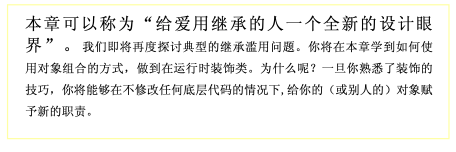
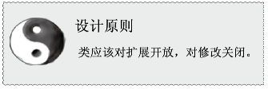
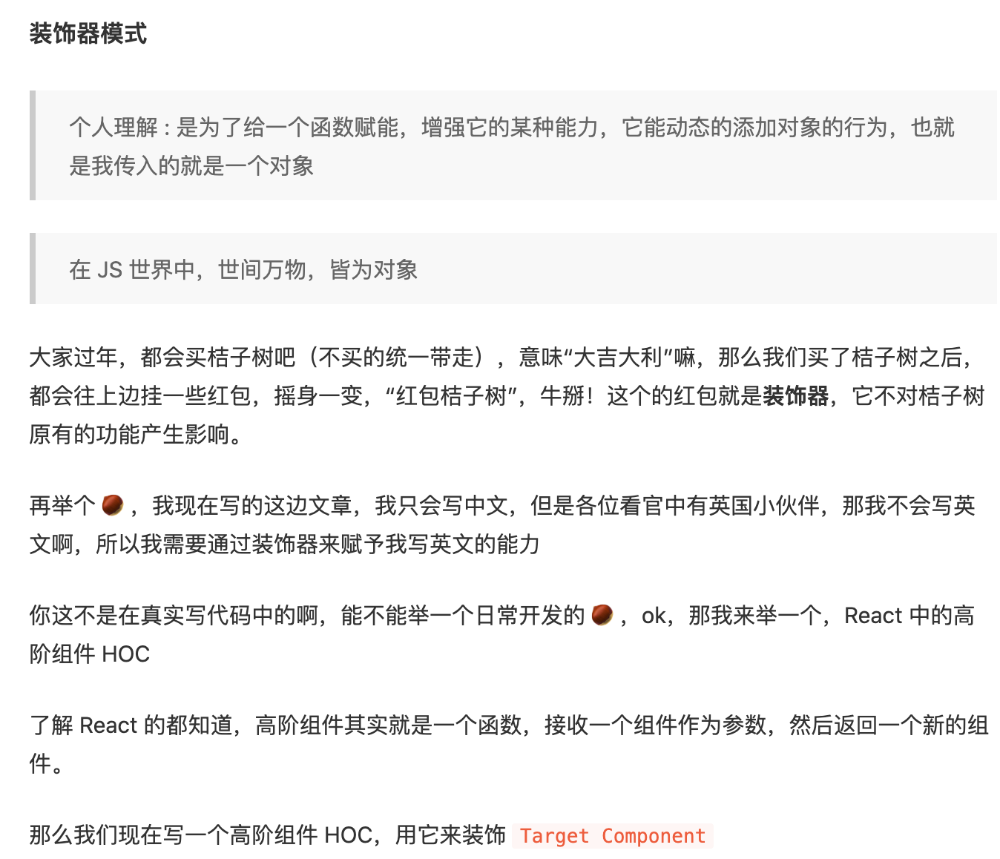

- 模式解释
   
  类的继承组合，是在编译时。
  但是在组合的时候，可以使用*装饰者模式*，在不修改任何底层代码的情况下，给函数新的能力。
  ES6 的装饰器就是这个模式，但是用法上很优雅简单。
   
  ---
  下沉到 JS 的应用。
  装饰器是*运行时*给对象增强*能力（方法、属性）*。面向对象的继承，则是静态编译时的，是 2 个阶段的策略。
  通常套路是，把需要被装饰的对象当做 param 传入函数，函数内部对这个实例进行能力增强之后再返回新的实例。
  典型例子有 HOC、包装函数。
   
  ```javascript
  class TargetComp extends React.Component {
  render() {
    return <div>target</div>
  }
  }
    const yellowHOC = WrapperComp => {
  return class extends React.Component {
    render() {
      return <div style={{ backgroundColor: ‘yellow’ }}>
        <WrapperComp {…this.props} />
      </div>
    }
  }
  }
  ```