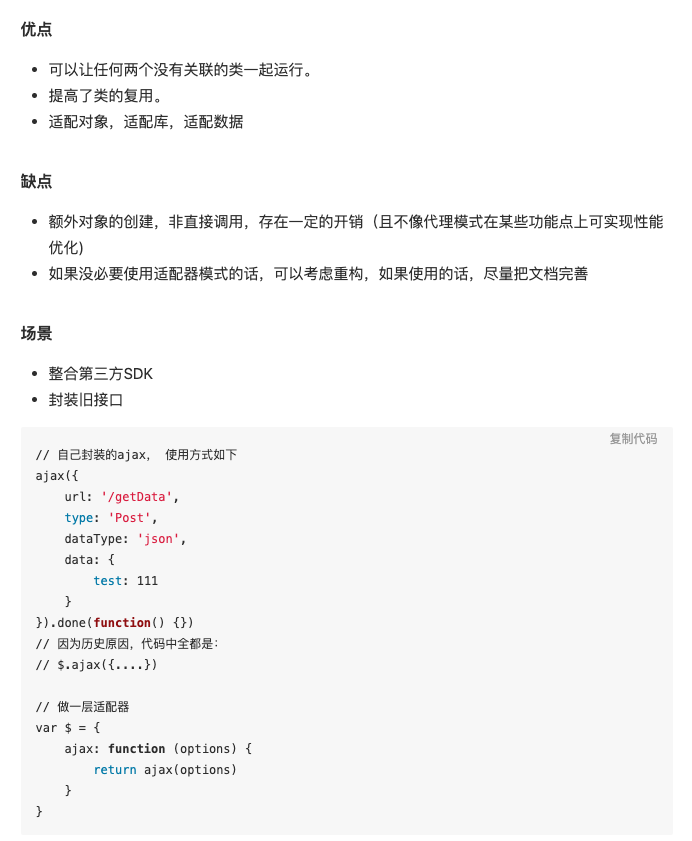

- 模式解释
  将一个类的接口转化为另外一个接口，以满足用户需求，使类之间接口不兼容问题通过适配器得以解决。
  比如一个接口或者数据结构表现出来的形状是 A，但是消费 A 的确实需要另一个形状 B。
  这个时候的选择有 2 个：
  A -> B
  B 兼容 A
  把 A -> B 这个 transform 或者包装的过程，就是一个*适配*的过程。即适配器。
  类的包装，data 的 computed 都是一个*适配*的过程。
  适配器应该装在哪一端的问题。
  在 A 端， 自由的 util 中的 transform，亦或 B 端。
  MVC 也可以理解成适配器，M 是原始数据，V 是消费者，C 的 controller 可以看做适配器，让 M 适配 V。
  
  原则一般是，定义固定的一方不做，而由无关紧要的一方进行操作。
  {:height 849, :width 692}